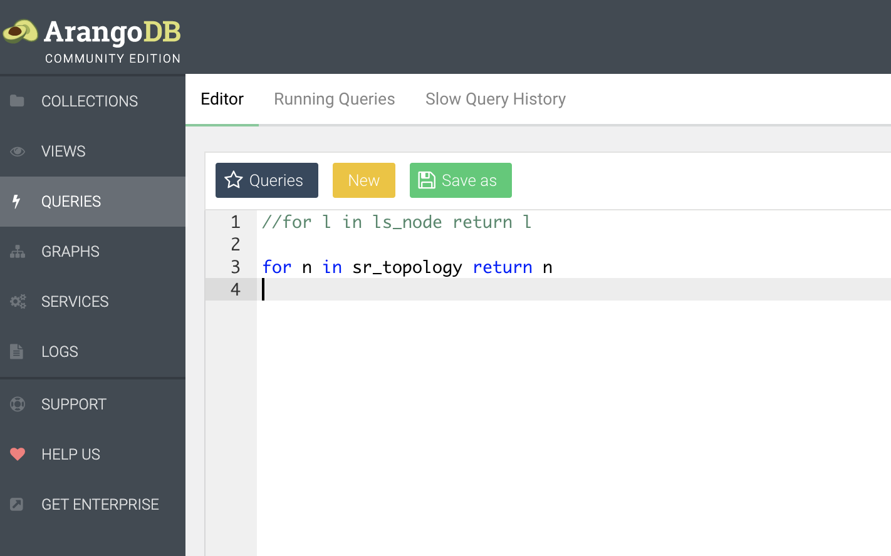

### Configure BGP Monitoring Protocol (BMP)

R05
```
bmp server 1
 host 198.18.128.101 port 30511
 description jalapeno GoBMP  
 update-source MgmtEth0/RP0/CPU0/0
 flapping-delay 60
 initial-delay 5
 stats-reporting-period 60
 initial-refresh delay 25 spread 2
!
router bgp 65000
 neighbor 10.0.0.1
  bmp-activate server 1
 !
 neighbor fc00:0:1::1
  bmp-activate server 1
  !
 !
 neighbor 10.0.0.7
  bmp-activate server 1
 !
 neighbor fc00:0:7::1
  bmp-activate server 1
  !
 !
! 

```

R06
```
bmp server 1
 host 198.18.128.101 port 30511
 description jalapeno GoBMP  
 update-source MgmtEth0/RP0/CPU0/0
 flapping-delay 60
 initial-delay 5
 stats-reporting-period 60
 initial-refresh delay 25 spread 2
!
router bgp 65000
 neighbor 10.0.0.1
  bmp-activate server 1
 !
 neighbor fc00:0:1::1
  bmp-activate server 1
  !
 !
 neighbor 10.0.0.7
  bmp-activate server 1
 !
 neighbor fc00:0:7::1
  bmp-activate server 1
  !
 !
! 

```

Validate changes:
```
ping 198.18.128.101
show bgp bmp server 1
```

Expected output:
```
RP/0/RP0/CPU0:xrd06#ping 198.18.128.101
Wed Dec 14 23:00:18.649 UTC
Type escape sequence to abort.
Sending 5, 100-byte ICMP Echos to 198.18.128.101, timeout is 2 seconds:
!!!!!
Success rate is 100 percent (5/5), round-trip min/avg/max = 1/2/7 ms

RP/0/RP0/CPU0:xrd06#sho bgp bmp ser 1  
Wed Dec 14 23:24:01.861 UTC
BMP server 1
Host 198.18.128.101 Port 30511
Connected for 00:01:18
...
```
ssh to the Jalapeno VM and run some Kubectl commands
```
ssh cisco@198.18.1.101

kubectl get all -A
kubectl get pods -n jalapeno
kubectl get pods -n jalapeno-collectors
kubectl get services -A

```
Kafka:
1. List Kafka topics
2. Listen to Kafka topics
```
kubectl exec -it kafka-0 /bin/bash -n jalapeno

cd bin
unset JMX_PORT

./kafka-topics.sh --list  --bootstrap-server localhost:9092
./kafka-console-consumer.sh --bootstrap-server localhost:9092  --topic gobmp.parsed.ls_node
./kafka-console-consumer.sh --bootstrap-server localhost:9092  --topic gobmp.parsed.ls_link
./kafka-console-consumer.sh --bootstrap-server localhost:9092  --topic gobmp.parsed.l3vpn_v4

./kafka-console-consumer.sh --bootstrap-server localhost:9092  --topic jalapeno.telemetry

```


Connect to Jalapeno's Arango GraphDB
```
http://198.18.1.101:30852/

user: root
password: jalapeno
DB: jalapeno

```
Explore data collections

Run DB Queries:
```
for l in ls_node return l
```
note: after running a query comment it out before running the next query. Example:



```
//for l in ls_node return l

for l in ls_link filter l.mt_id !=2 return l
```
More queries:
```
for n in ls_node_edge return n

for n in sr_topology return n

for l in sr_node return { sid: l.prefix_sid, address: l.address }

for v, e in outbound shortest_path 'sr_node/2_0_0_0000.0000.0025' TO 'unicast_prefix_v4/10.10.3.0_24_10.0.0.29' sr_topology return  { prefix: v.prefix, name: v.name, sid: e.srv6_sid, latency: e.latency }

```