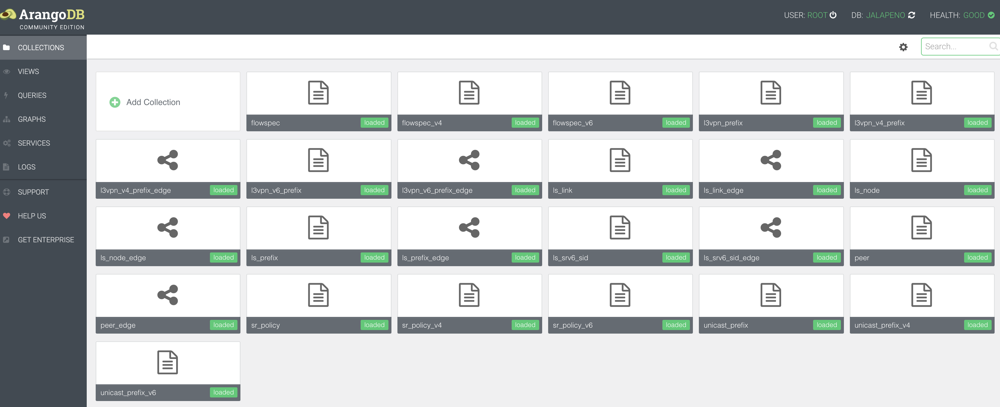
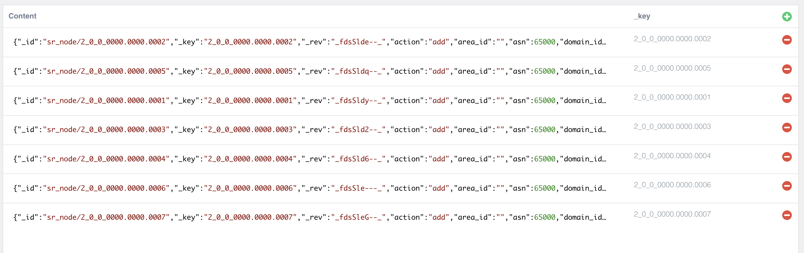

# Lab 4: Install Jalapeno and enable BMP [20 Min]

### Description
In Lab 4 we will install the open-source Jalapeno data infrastructure platform. Jalapeno is designed to run on Kubernetes (k8s), which allows for easy integration into existing environments and supports deployment on bare metal, VMs, or in a public cloud. Kubernetes experience is not required for this lab as K8s has been preinstalled on the Jalapeno VM and we have included the required *kubectl* validation commands. 

Prior to working the Jalapeno we will first configure BGP Monitoring Protocol (BMP) on our route reflectors. 

## Contents
- [Lab 4: Install Jalapeno and enable BMP \[20 Min\]](#lab-4-install-jalapeno-and-enable-bmp-20-min)
    - [Description](#description)
  - [Contents](#contents)
  - [Lab Objectives](#lab-objectives)
  - [Jalapeno Overview](#jalapeno-overview)
    - [Jalapeno Architecture and Data Flow](#jalapeno-architecture-and-data-flow)
  - [Validate Jalapeno](#validate-jalapeno)
  - [BGP Monitoring Protocol (BMP)](#bgp-monitoring-protocol-bmp)
  - [BGP SRv6 locator](#bgp-srv6-locator)
  - [Install Jalapeno GraphDB Processors](#install-jalapeno-graphdb-processors)
      - [Return to the ssh session on the Jalapeno VM](#return-to-the-ssh-session-on-the-jalapeno-vm)
    - [End of Lab 4](#end-of-lab-4)

## Lab Objectives
The student upon completion of Lab 4 should have achieved the following objectives:

* High level understanding of the Jalapeno data collection and topology modeling stack
* Understanding and configuration of BMP

## Jalapeno Overview
Project Jalapeno combines existing open source tools with some new stuff we've developed into a data collection and warehousing infrastructure intended to enable development of network service applications. Think of it as applying microservices architecture and concepts to SDN: give developers the ability to quickly and easily build microservice control planes on top of a common data infrastructure. More information on Jalapeno can be found at the Jalapeno Git repository: [LINK](https://github.com/cisco-open/jalapeno/blob/main/README.md)

### Jalapeno Architecture and Data Flow


Jalapeno breaks the data collection and warehousing problem down into a series of components and services:
- **Data Collector** services such as GoBMP and Telegraf collect network topology and statistics and publish to Kafka
- **Data Processor** services such as "Topology" (and other future services) subscribe to Kafka topics and write the data they receive to databases
- **Kafka** is used as a message bus between Collectors and Processors
- **Arango GraphDB** is used for modeling topology data
- **InfluxDB** is used for warehousing statistical time-series data
- **API-Gateway**: is currently under construction so for the lab we'll interact directly with the DB
- **Jalapeno's installation script** will also deploy a Grafana container, which can be used to create dashboards to visualize the Influx time-series data

One of the primary goals of the Jalapeno project is to be flexible and extensible. In the future we expect Jalapeno might support any number of data collectors and processors. For example the could be a collector/processor pair that creates an LLDP Topology model in the graphDB. Netflow data could be incorporated via a future integration with pmacct. Or an operator might already have a telemetry stack and could choose to selectively integrate Jalapeno's GoBMP/Topology/GraphDB modules into an existing environment running Kafka. We also envision future integrations with other API-driven data warehouses such as Cisco ThousandEyes: https://www.thousandeyes.com/

## Validate Jalapeno 

The Jalapeno package is preinstalled and running on the **Jalapeno** VM

1. Verify k8s pods are running (note, some pods may initially be in a *CrashLoopBackOff* state. These should resolve after 2-3 minutes). For those students new to Kubernetes you can reference this cheat sheet [HERE](https://kubernetes.io/docs/reference/kubectl/cheatsheet/)  

    - ssh to Jalapeno VM
    ```
    ssh cisco@198.18.128.101
    ```
    - verify k8s pods
    ```
    kubectl get pods -A
    ```
    Output should look something like:  

    ```
    cisco@jalapeno:~/jalapeno/install$ kubectl get pods -A
    NAMESPACE             NAME                                           READY   STATUS    RESTARTS        AGE
    jalapeno-collectors   gobmp-5db68bd644-hzs82                         1/1     Running   3 (4m5s ago)    4m25s  
    jalapeno-collectors   telegraf-ingress-deployment-5b456574dc-wdhjk   1/1     Running   1 (4m2s ago)    4m25s  
    jalapeno              arangodb-0                                     1/1     Running   0               4m33s
    jalapeno              grafana-deployment-565756bd74-x2szz            1/1     Running   0               4m32s
    jalapeno              influxdb-0                                     1/1     Running   0               4m32s
    jalapeno              kafka-0                                        1/1     Running   0               4m33s
    jalapeno              lslinknode-edge-b954577f9-k8w6l                1/1     Running   4 (3m35s ago)   4m18s
    jalapeno              telegraf-egress-deployment-5795ffdd9c-t8xrp    1/1     Running   2 (4m11s ago)   4m19s
    jalapeno              topology-678ddb8bb4-rt9jg                      1/1     Running   3 (4m1s ago)    4m19s
    jalapeno              zookeeper-0                                    1/1     Running   0               4m33s
    kube-system           calico-kube-controllers-798cc86c47-d482k       1/1     Running   4 (16m ago)     14d
    kube-system           calico-node-jd7cw                              1/1     Running   4 (16m ago)     14d
    kube-system           coredns-565d847f94-fr8pp                       1/1     Running   4 (16m ago)     14d
    kube-system           coredns-565d847f94-grmtl                       1/1     Running   4 (16m ago)     14d
    kube-system           etcd-jalapeno                                  1/1     Running   5 (16m ago)     14d
    kube-system           kube-apiserver-jalapeno                        1/1     Running   5 (16m ago)     14d
    kube-system           kube-controller-manager-jalapeno               1/1     Running   6 (16m ago)     14d
    kube-system           kube-proxy-pmwft                               1/1     Running   5 (16m ago)     14d
    kube-system           kube-scheduler-jalapeno                        1/1     Running   6 (16m ago)     14d
    ```

2. Here are some additional k8s commands to try. Note the different outputs when specifying a particular namespace (-n option) vs. all namespaces (-A option):
    ```
    kubectl get pods -n jalapeno                      <-------- display all pods/containers in the Jalapeno namespace
    kubectl get pods -n jalapeno-collectors           <-------- display all pods/containers in the Jalapeno-Collectors namespace
    kubectl get services -A                           <-------- display all externally reachable services (BMP, Arango, etc.)
    kubectl get all -A                                <-------- display a summary of all cluster info
    kubectl get nodes                                 <-------- display cluster node info
    kubectl describe pod -n <namespace> <pod name>    <-------- display detailed info about a pod

    example: kubectl describe pod -n jalapeno topology-678ddb8bb4-rt9jg
    ```

## BGP Monitoring Protocol (BMP)

Most transport SDN systems use BGP-LS to gather and model the underlying IGP topology. Jalapeno is intended to be a more generalized data platform to support use cases beyond internal transport such as VPNs or service chains. Because of this, Jalapeno's primary method of capturing topology data is via BMP. BMP provides all BGP AFI/SAFI info, thus Jalapeno is able to model many different kinds of topology, including the topology of the Internet (at least from the perspective of our peering routers).

We'll first establish a BMP session between our route-reflectors and the open-source GoBMP collector, which comes pre-packaged with the Jalapeno install. We'll then enable BMP monitoring of the RRs' BGP peering sessions with our PE routers xrd01 and xrd07. Once established, the RRs' will stream all BGP NLRI info they receive from the PE routers to the GoBMP collector, which will in turn publish the data to Kafka. We'll get more into the Jalapeno data flow in Lab 5.

GoBMP Git Repository [HERE]((https://github.com/sbezverk/gobmp)

1. BMP configuration on **xrd05** and **xrd06**:
    ```
    bmp server 1
      host 198.18.128.101 port 30511
      description jalapeno GoBMP  
      update-source MgmtEth0/RP0/CPU0/0
      flapping-delay 60
      initial-delay 5
      stats-reporting-period 60
      initial-refresh delay 25 spread 2
    
    router bgp 65000
      neighbor 10.0.0.1
        bmp-activate server 1
    
      neighbor fc00:0000:1111::1
        bmp-activate server 1

      neighbor 10.0.0.7
        bmp-activate server 1
    
      neighbor fc00:0000:7777::1
        bmp-activate server 1
    commit
    ```

2. Validate BMP session establishment and client monitoring (the session may take a couple minutes to become active/established):
    ```
    show bgp bmp summary
    ```

    Expected output:  
    ```
    RP/0/RP0/CPU0:xrd06#show bgp bmp sum
    Sat Dec 16 03:19:26.045 UTC
    ID   Host                 Port     State   Time        NBRs
    1   198.18.128.101       30511    ESTAB   00:00:07    4   
    RP/0/RP0/CPU0:xrd06#

    ```

3. Validate Jalapeno has populated the Arango graphDB with BMP data. Open the Arango web UI at:

    ```
    http://198.18.128.101:30852/
    ```
    - Login and select the "jalapeno" DB from the dropdown:
    ```
    user: root
    password: jalapeno
    DB: jalapeno
    ```
    Once logged the UI should then show you its 'collections' view, which should look something like:

  

1. Feel free to spot check the various data collections in Arango. Several will be empty as they are for future use. With successful BMP processing we would expect to see data in all the following collections:

    - l3vpn_v4_prefix
    - l3vpn_v6_prefix
    - ls_link
    - ls_node
    - ls_node_edge
    - ls_prefix
    - ls_srv6_sid
    - peer
    - unicast_prefix_v4
    - unicast_prefix_v6

## BGP SRv6 locator
In lab 1 we configured an SRv6 locator for the BGP global/default table. When we get to lab 6 we'll use these locators as we'll be sending SRv6 encapsulated traffic directly to/from Amsterdam and Rome. With our endpoints performing SRv6 encapsulation our BGP SRv6 locator will provide the end.DT4/6 function at the egress nodes *`xrd01`* and *`xrd07`*) to be able to pop the SRv6 encap and perform a global table lookup on the underlying payload.

1. Optional - re-validate end.DT4/6 SIDs belonging to BGP default table:
    ```
    show segment-routing srv6 sid
    ```

    Expected output on **xrd01** should look something like:  
    ```
    RP/0/RP0/CPU0:xrd01#show segment-routing srv6 sid
    Sat Dec 16 03:25:40.943 UTC

    *** Locator: 'MyLocator' *** 

    SID                         Behavior          Context                           Owner               State  RW
    --------------------------  ----------------  --------------------------------  ------------------  -----  --
    fc00:0:1111::               uN (PSP/USD)      'default':4369                    sidmgr              InUse  Y 
    fc00:0:1111:e000::          uA (PSP/USD)      [Gi0/0/0/1, Link-Local]:0:P       isis-100            InUse  Y 
    fc00:0:1111:e001::          uA (PSP/USD)      [Gi0/0/0/1, Link-Local]:0         isis-100            InUse  Y 
    fc00:0:1111:e002::          uA (PSP/USD)      [Gi0/0/0/2, Link-Local]:0:P       isis-100            InUse  Y 
    fc00:0:1111:e003::          uA (PSP/USD)      [Gi0/0/0/2, Link-Local]:0         isis-100            InUse  Y 
    fc00:0:1111:e004::          uDT4              'default'                         bgp-65000           InUse  Y 
    fc00:0:1111:e005::          uDT4              'carrots'                         bgp-65000           InUse  Y 
    fc00:0:1111:e006::          uDT6              'default'                         bgp-65000           InUse  Y 
    fc00:0:1111:e007::          uDT6              'carrots'                         bgp-65000           InUse  Y 
    fc00:0:1111:e008::          uB6 (Insert.Red)  'srte_c_50_ep_fc00:0:7777::1' (50, fc00:0:7777::1)  xtc_srv6            InUse  Y 
    fc00:0:1111:e009::          uB6 (Insert.Red)  'srte_c_40_ep_fc00:0:7777::1' (40, fc00:0:7777::1)  xtc_srv6            InUse  Y 
    RP/0/RP0/CPU0:xrd01#
    ``` 
## Install Jalapeno GraphDB Processors
These container images are a set of proof-of-concept data processors that augment Jalapeno's graphDB modeling of the network.  

  - The *`lsnode-extended`* processor loops through various link-state data collections and gathers relevant SR/SRv6 data for each node in the network and populates the data in a new *`ls_node_extended`* data collection. 
  
  - The *`linkstate-edge-v4`* and *`linkstate-edge-v6`* processors generate separate graphs of the ipv4 and ipv6 link state topologies using the ls_node_extended elements.

  - The *`ebgp-processor`* loops through the data collections and separates out eBGP and iBGP prefixes.
  
  - The *`ipv4-topology`* and *`ipv4-topology`* processors loop through the link-state graphs and other collections to add internal and external links, nodes, peers, prefixes, etc. to provide a complete topology model for both IPv4 and IPv6.
  
  - The *`srv6-localsids`* processor harvests SRv6 SID data from a Kafka streaming telemetry topic and populates it in the *`sr_local_sids`* collection. This data is not available via BMP and is needed to construct full End.DT SIDs that we'll use in lab 6.  Example:

```

SID                         Behavior          Context                    Owner              
----------------------  --------------  -----------------------------  ------------
fc00:0:1111::           uN (PSP/USD)    'default':4369                 sidmgr     <-------- Collected via BMP
fc00:0:1111:e000::      uA (PSP/USD)    [Gi0/0/0/1, Link-Local]:0:P    isis-100    <---|   
fc00:0:1111:e001::      uA (PSP/USD)    [Gi0/0/0/1, Link-Local]:0      isis-100    <---|  These are not available via BMP
fc00:0:1111:e002::      uA (PSP/USD)    [Gi0/0/0/2, Link-Local]:0:P    isis-100    <---|  We collect and process
fc00:0:1111:e003::      uA (PSP/USD)    [Gi0/0/0/2, Link-Local]:0      isis-100    <---|  these SIDs via streaming
fc00:0:1111:e004::      uDT4            'carrots'                      bgp-65000   <---|  telemetry and the 
fc00:0:1111:e005::      uDT6            'carrots'                      bgp-65000   <---|  "srv6-localsids" processor

```

#### Return to the ssh session on the Jalapeno VM

1. Install Jalapeno GraphDB Processors with the 'deploy' shell script. The script will execute *kubectl apply -f < yaml filename > * commands which launch the specified pods per the yaml configurations

    ```
    cd ~/SRv6_dCloud_Lab/lab_4/graphdb-processors

    cat deploy-processors.sh
   
    ./deploy-processors.sh
    ```
    - Example output:
    ```
    cisco@jalapeno:~/SRv6_dCloud_Lab/lab_4/graphdb-processors$ ./deploy-processors.sh 
    deployment.apps/linkstate-node-ext created
    deployment.apps/linkstate-edge-v4 created
    deployment.apps/linkstate-edge-v6 created
    deployment.apps/ebgp-processor created
    deployment.apps/ipv4-topology created
    deployment.apps/ipv6-topology created
    ```

2. Validate the pods are up and running in the 'jalapeno' namespace:
    ```
    kubectl get pods -n jalapeno
    ```
    #### Expected output:  
    Look for the new pods running in the jalapeno namespace
    ```
    cisco@jalapeno:~/SRv6_dCloud_Lab/lab_4/graphdb-processors$ kubectl get pods -n jalapeno
    NAME                                          READY   STATUS    RESTARTS       AGE
    arangodb-0                                    1/1     Running   6 (15h ago)    326d
    ebgp-processor-558948c6-6ltrp                 1/1     Running   0              38s        <------ eBGP proc
    grafana-deployment-565756bd74-b5vpd           1/1     Running   6 (15h ago)    326d
    influxdb-0                                    1/1     Running   6 (15h ago)    326d
    ipv4-topology-85b8c6d5b4-z7cjd                1/1     Running   0              36s        <------ ipv4 topo
    ipv6-topology-bd57bdf54-g858l                 1/1     Running   0              35s        <------ ipv6 topo
    kafka-0                                       1/1     Running   8 (15h ago)    326d
    linkstate-edge-v4-6585877c8c-vv2kz            1/1     Running   0              41s        <------ lsv4 topo
    linkstate-edge-v6-77f87bf449-qnw85            1/1     Running   0              40s        <------ lsv6 topo
    linkstate-node-ext-7bb97dcf89-gt7s4           1/1     Running   0              43s        <------ ls node extended
    lslinknode-edge-b954577f9-bjnsh               1/1     Running   27 (15h ago)   326d
    telegraf-egress-deployment-5795ffdd9c-277xn   1/1     Running   25 (15h ago)   326d
    topology-678ddb8bb4-89c6d                     1/1     Running   26 (15h ago)   326d
    zookeeper-0                                   1/1     Running   6 (15h ago)    326d
    ```
3. Check ArangoDB for new *`sr_node`*, *`sr_topology`*, and *`srv6_local_sids`* data collections, and that they contain data. For example, *`sr_node`* should look something like this with seven entries:

  

 - Note: srv6_local_sids may not populate with data for up to 2 minutes as it is reliant on streaming telemetry configuration of 120 seconds (see xrd01 'telemetry model-driven' config section). 

### End of Lab 4
Please proceed to [Lab 5](https://github.com/jalapeno/SRv6_dCloud_Lab/tree/main/lab_5/lab_5-guide.md)