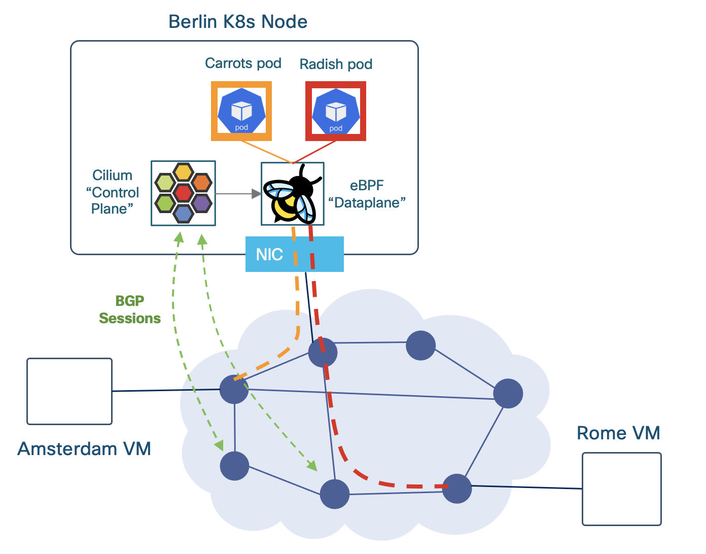

# Lab 4: SRv6 for Kubernetes with Cilium [25 Min]

### Description
Now that we've established SRv6 L3VPNs across our network, we're going to transition from router-based services to host-based services. And our first step will be to enable SRv6 L3VPN for Kubernetes. The Berlin VM has had Kubernetes pre-installed and running the Cilium CNI (Container Network Interface). In this lab we'll review some basic Kubernetes commands (kubectl) and then we'll setup Cilium BGP peering with our XRd route reflectors. After that we'll configure Cilium SRv6 SID manager and Locator pool. We'll then add a couple containers to our K8s cluster and join them to the carrots VRF.

> [!NOTE]
> This portion of the lab makes use of Cilium Enterprise, which is a licensed set of features. The Cilium SRv6 feature set is in Beta is not available in the open source version. If you are interested in SRv6 on Cilium or other Enterprise features, please contact the relevant Cisco Isovalent sales team.  

Isovalent has also published a number of labs covering a wide range of Cilium, Hubble, and Tetragon features here:

https://cilium.io/labs/

The original version of this lab was developed in partnership with Arkadiusz Kaliwoda, Cisco SE in EMEA SP

### Contents
* Description [LINK](#description)
* Validate Cilium Run State [LINK](#validate-cilium-run-state)
* Setup Cilium BGP Peering [LINK](#setup-cilium-bgp-peering)
* Cilium SRv6 SID manager and Locators [LINK](#cilium-srv6-sid-manager-and-locators)
* Establish Cilium VRFs [LINK](#establish-cilium-vrfs)
* Setup Cilium SRv6 Responder [LINK](#setup-cilium-srv6-responder)

### Validate Cilium Run State

Kubernetes and Cilium Enterprise are pre-installed on the Berlin VM. All of the following steps are to be performed on the Berlin VM unless otherwise specified.

1. SSH into the Berlin VM and cd into the lab_4/cilium directory and check out the contents
   ```
   ssh cisco@198.18.128.104
   cd ~/SRv6_dCloud_Lab/lab_4/cilium/
   ```

2. Run a couple commands to verify the Cilium Installation

   Display Cilium pods:
   ```
   kubectl get pods -n kube-system
   ```
   The Cilium portion of the output should look someething like this:
   ```yaml
   cisco@berlin:~/SRv6_dCloud_Lab/lab_4/cilium$    kubectl get pods -n kube-system
   NAME                               READY   STATUS    RESTARTS   AGE
   cilium-envoy-p6pgd               1/1     Running   0          2m36s
   cilium-jbnmh                     1/1     Running   0          2m36s
   cilium-node-init-2m6j8           1/1     Running   0          2m36s
   cilium-operator-d6fc9cf7-7v2gt   1/1     Running   0          2m36s
   cilium-operator-d6fc9cf7-ns6mc   0/1     Pending   0          2m36s
   ```

  Notes on the pods:
  * `Cilium-envoy`: used as a host proxy for enforcing HTTP and other L7 policies as specified in network policies for the cluster. For further reading see: https://docs.cilium.io/en/latest/security/network/proxy/envoy/
  * `Cilium-node-init`: used to initialize the node and install the Cilium agent.
  * `Cilium-operator`: used to manage the Cilium agent on the node. The second operator pod is pending as its waiting for another node to join the cluster.
  * `Cilium-jbnmh`: is the Cilium agent on the node, and the element that will perform BGP peering and programming of eBPF SRv6 forwarding policies.


   Display Cilium DaemonSet status:
   ```
   kubectl get ds -n kube-system cilium
   ```
   The output should show a single Cilium DaemonSet (ds) available, example:
   ```
   cisco@berlin:~$   kubectl get ds -n kube-system cilium
   NAME     DESIRED   CURRENT   READY   UP-TO-DATE   AVAILABLE   NODE SELECTOR            AGE
   cilium   1         1         1       1            1           kubernetes.io/os=linux   94m
   ```
> [!NOTE]
> A Kubernetes DaemonSet is a feature that ensures a pod runs on all or some nodes in a Kubernetes cluster. DaemonSets are used to deploy background services, such as monitoring agents, network agents (such as Cilium/eBPF), log collectors, and storage volumes.

Now we're ready!


##  Setup Cilium BGP Peering
First a brief explanation of *`Kubernetes Custom Resource Definitions (CRDs)`*. 

Per: https://kubernetes.io/docs/concepts/extend-kubernetes/api-extension/custom-resources/

*A custom resource is an extension of the Kubernetes API that is not necessarily available in a default Kubernetes installation. It represents a customization of a particular Kubernetes installation. However, many core Kubernetes functions are now built using custom resources, making Kubernetes more modular.*

Said another way, CRDs enable us to add, update, or delete Kubernetes cluster elements and their configurations. The add/update/delete action might apply to the cluster as a whole, a node in the cluster, an aspect of cluster networking or the CNI (aka, the work we'll do in this lab), or any given element or set of elements within the cluster including pods, services, daemonsets, etc.

A CRD applied to a single element in the K8s cluster would be analogous configuring BGP on a router. A CRD applied to multiple or cluster-wide would be analogous to adding BGP route-reflection to a network as a whole. 

CRDs come in YAML file format and in the next several sections of this lab we'll apply CRDs to the K8s cluster to setup Cilium BGP peering, establish Cilium SRv6 locator ranges, create VRFs, etc.

For the sake of simplicity in this lab we'll use iBGP peering between our Berlin K8s node and our route reflectors xrd05 and xrd06. 

Here is a portion of our Cilium BGP configuration in CRD form and with notes:
```yaml
apiVersion: isovalent.com/v1alpha1
kind: IsovalentBGPClusterConfig
metadata:
  name: cilium-bgp 
spec:
  nodeSelector:
    matchLabels:
      kubernetes.io/hostname: berlin    # node to which this portion of config belongs
  bgpInstances:                         # the k8s cluster could have multiple BGP instances
  - name: "asn65000"                    # for simplicity we're using a single ASN end-to-end
    localASN: 65000
    peers:
    - name: "xrd05-rr"                  # base peering config
      peerASN: 65000                   
      peerAddress: fc00:0:5555::1       
      peerConfigRef:
        name: "cilium-peer"             # reference to additional peer config in another CRD
    - name: "xrd06-rr"
      peerASN: 65000
      peerAddress: fc00:0:6666::1
      peerConfigRef:
        name: "cilium-peer"
```

One of the great things about CRDs is you can combine all the configuration elements into a single file, or you can break it up into multiple files by configuration element: 

* [01-bgp-cluster.yaml](cilium/01-bgp-cluster.yaml) - Cilium BGP global configuration
* [02-bgp-peer.yaml](cilium/02-bgp-peer.yaml) - Cilium BGP peer address families and route policies
* [03-bgp-node-override.yaml](cilium/03-bgp-node-override.yaml) - Cilium BGP node override; we use this to specify the BGP source address
* [04-bgp-advert.yaml](cilium/04-bgp-advert.yaml) - Cilium BGP prefix advertisement(s), including SRv6 locator prefix(s)
* [05-bgp-vrf.yaml](cilium/05-bgp-vrf.yaml) - Cilium BGP VRF configuration(s)
* [06-srv6-locator-pool.yaml](cilium/06-srv6-locator-pool.yaml) - Cilium SRv6 SID manager and Locator pool configuration
* [07-vrf-carrots.yaml](cilium/07-vrf-carrots.yaml) - Cilium VRF 'carrots' configuration and pods


In the next few steps we'll walk through applying the configuration one element at a time. For reference the [99-cilium-all.yaml](cilium/99-cilium-all.yaml) yaml file, would apply all the elements at once.

### Establish the Cilium BGP global and peer configurations

1. On the Berlin VM cd into the Lab 4 cilium directory and apply the Cilium BGP Cluster Config CRD. BGP Cluster config establishes our Cilium Node's BGP ASN and base BGP peering with the route reflectors *`xrd05`* and *`xrd06`*.
   ```
   cd ~/SRv6_dCloud_Lab/lab_4/cilium/
   kubectl apply -f 01-bgp-cluster.yaml
   ```

2. Apply the Cilium BGP Peer Config CRD. This CRD is where we control address families and other BGP peering or route policies.
   ```
   kubectl apply -f 02-bgp-peer.yaml
   ```

   Expected output for steps #1 and #2:
   ```
   isovalentbgpclusterconfig.isovalent.com/cilium-bgp created
   isovalentbgppeeringpolicy.isovalent.com/cilium-peer created
   ```

3. At this point our peer sessions are not yet established. Next we'll apply the *`localAddress`* parameter which tells Cilium which source address to use for its BGP peering sessions. This knob is comparable to IOS-XR's `update-source` parameter.
   ```
   kubectl apply -f 03-bgp-node-override.yaml
   ```

   Expected output:
   ```
   isovalentbgpnodeconfigoverride.isovalent.com/berlin created
   ```


4. Verify Cilium BGP peering with the following cilium CLI. Note, it may take a few seconds for the peering sessions to establish.
   ```
   cilium bgp peers
   ```

   We expect to have two IPv6 BGP peering sessions established and receiving BGP NLRIs for IPv6 and IPv4/mpls_vpn (aka, SRv6 L3VPN).

   Example:
   ```
   cisco@berlin:~/SRv6_dCloud_Lab/lab_4/cilium$ cilium bgp peers
   Node     Local AS   Peer AS   Peer Address     Session State   Uptime   Family          Received   Advertised
   berlin   65000      65000     fc00:0:5555::1   established     9s       ipv6/unicast    5          0    
                                                                           ipv4/mpls_vpn   5          0    
            65000      65000     fc00:0:6666::1   established     24s      ipv6/unicast    5          0    
                                                                           ipv4/mpls_vpn   5          0  
   ```

We have not added ipv6 prefix advertisesments yet, hence a zero value in the Advertised output above. Also, *`xrd05`* and *`xrd06`*'s peering sessions with Cilium inherited the vpnv4 address family configuration during Lab 3 so we don't need to update their configs. 

5. Apply the BGP ipv6 unicast (global table/default VRF) prefix advertisement CRD:
   ```
   kubectl apply -f 04-bgp-advert.yaml
   ```

6. Verify the prefix advertisement:
   ```
   cilium bgp peers
   ```

5. Let's get a little more detail on advertised prefixes with the `cilium bgp routes` command. Let's first add a -h flag to see our options
   ```
   cilium bgp routes -h
   ```

   Example output:
   ```
   cisco@berlin:~/SRv6_dCloud_Lab/lab_4/cilium$ cilium bgp routes -h
   Lists BGP routes from all nodes in the cluster - requires cilium >= v1.14.6

   Usage:
     cilium bgp routes <available | advertised> <afi> <safi> [vrouter <asn>] [peer|neighbor <address>] [flags]
   ```

6. Let's get the advertised prefixes:
   ```
   cilium bgp routes advertised ipv6 unicast
   ```

   Example output, currently we're only advertising the global table pod CIDR:
   ```
   cisco@berlin:~/SRv6_dCloud_Lab/lab_4/cilium$ cilium bgp routes advertised ipv6 unicast
   Node     VRouter   Peer             Prefix             NextHop          Age   Attrs
   berlin   65000     fc00:0:5555::1   2001:db8:42::/64   fc00:0:8888::1   18s   [{Origin: i} {AsPath: } {LocalPref: 100} {MpReach(ipv6-unicast): {Nexthop: fc00:0:8888::1, NLRIs: [2001:db8:42::/64]}}]   
            65000     fc00:0:6666::1   2001:db8:42::/64   fc00:0:8888::1   18s   [{Origin: i} {AsPath: } {LocalPref: 100} {MpReach(ipv6-unicast): {Nexthop: fc00:0:8888::1, NLRIs: [2001:db8:42::/64]}}] 
   ```

7. Create the carrots BGP VRF:
   ```
   kubectl apply -f 05-bgp-vrf.yaml
   ```

Our Cilium BGP configuration is now complete. Next we'll setup the Cilium SRv6 SID manager and locators.

## Cilium SRv6 SID Manager and Locators
Per Cilium Enterprise documentation:
*The SID Manager manages a cluster-wide pool of SRv6 locator prefixes. You can define a prefix pool using the IsovalentSRv6LocatorPool resource. The Cilium Operator assigns a locator for each node from this prefix. In this example we'll allocate /48 bit uSID based locators.*

1. Define and apply a Cilium SRv6 locator pool, example: [06-srv6-locator-pool.yaml](cilium/06-srv6-locator-pool.yaml)
  
   From the SRv6_dCloud_Lab/lab_4/cilium directory on the Berlin VM:
   ```
   kubectl apply -f 06-srv6-locator-pool.yaml
   ```

The BGP prefix advertisement CRD included a spec for advertising the SRv6 locator pool as well:
   ```yaml
     advertisements:
       - advertisementType: "SRv6LocatorPool"
         selector:
           matchLabels:
             export: "pool0"
   ```

2. Now that we have a local pool to advertise, let's check our BGP advertised prefixes again:
   ```
   cilium bgp routes advertised ipv6 unicast
   ```

   Example output, we are now advertising the SRv6 locator pool...but only to one neighbor (see note below):
   ```yaml
   cisco@berlin:~/SRv6_dCloud_Lab/lab_4/cilium$ cilium bgp routes advertised ipv6 unicast
   Node     VRouter   Peer             Prefix             NextHop          Age     Attrs
   berlin   65000     fc00:0:5555::1   2001:db8:42::/64   fc00:0:8888::1   2m52s   [{Origin: i} {AsPath: } {LocalPref: 100} {MpReach(ipv6-unicast): {Nexthop: fc00:0:8888::1, NLRIs: [2001:db8:42::/64]}}]   
            65000     fc00:0:6666::1   2001:db8:42::/64   fc00:0:8888::1   2m52s   [{Origin: i} {AsPath: } {LocalPref: 100} {MpReach(ipv6-unicast): {Nexthop: fc00:0:8888::1, NLRIs: [2001:db8:42::/64]}}]   
            65000     fc00:0:6666::1   fc00:0:a01f::/48   fc00:0:8888::1   6s      [{Origin: i} {AsPath: } {LocalPref: 100} {MpReach(ipv6-unicast): {Nexthop: fc00:0:8888::1, NLRIs: [fc00:0:a01f::/48]}}] 
   ```

> [!NOTE]
> The Cilium image we are currently using has a bug where the SRv6 locator pool is only advertised to one neighbor. A fix is being incorporated in the 1.18 release.

3. Now that we've allocated a locator pool, let's validate it:
   ```
   kubectl get sidmanager -o yaml
   ```
   
   Or for a more concise output:
   ```
   kubectl get sidmanager -o custom-columns="NAME:.metadata.name,ALLOCATIONS:.spec.locatorAllocations"
   ```

   The example output below shows Cilium having allocated locator prefixes as follows:
   **berlin: fc00:0:a09f::/48**

   Example output:

   ```yaml
   cisco@berlin:~/SRv6_dCloud_Lab/lab_4/cilium$ kubectl get sidmanager -o yaml
   apiVersion: v1
   items:
   - apiVersion: isovalent.com/v1alpha1
    kind: IsovalentSRv6SIDManager
    metadata:
      creationTimestamp: "2025-01-13T22:55:05Z"
      generation: 5
      name: berlin
      resourceVersion: "48034"
      uid: dd82d5d0-6d84-4cc8-ac31-ed2f3ce857f7
    spec:
      locatorAllocations:
      - locators:
        - behaviorType: uSID
          prefix: fc00:0:a0ba::/48               # Berlin's dynamically allocated uSID prefix (Locator)
          structure:
            argumentLenBits: 0
            functionLenBits: 16
            locatorBlockLenBits: 32
            locatorNodeLenBits: 16
        poolRef: pool0
     status:
       sidAllocations: []
   kind: List
   metadata:
    resourceVersion: ""
   ```

## Establish Cilium VRFs and Create Pods
1. Add vrf(s) - this example also adds a couple alpine linux container pods to vrf carrots:
   [07-vrf-carrots.yaml](cilium/07-vrf-carrots.yaml)
   ```
   kubectl apply -f 07-vrf-carrots.yaml
   ```

2. Verify the VRF carrots pods are running:
   ```
   kubectl get pods -n carrots
   ```

   Expected output:
   ```
   NAME      READY   STATUS    RESTARTS   AGE
   carrots0   1/1     Running   0          10s
   carrots1   1/1     Running   0          10s
   ``` 

3. Let's get the pods' IP addresses as we'll need them in a few more steps:
   ```
   kubectl get pod -n carrots carrots0 -o jsonpath="{.status.podIPs}" && echo
   kubectl get pod -n carrots carrots1 -o jsonpath="{.status.podIPs}" && echo
   ```

   Expected output should look something like:
   ```
   [{"ip":"10.200.0.242"},{"ip":"2001:db8:42::2131"}]
   [{"ip":"10.200.0.3"},{"ip":"2001:db8:42::dad9"}]
   ```

4. Next we'll verify Cilium has allocated the carrots VRF a uDT4 SRv6 L3VPN SID on Berlin:
   ```
   kubectl get sidmanager berlin -o yaml
   ```

    Example output from sidmanager:
    ```yaml
    apiVersion: isovalent.com/v1alpha1
    kind: IsovalentSRv6SIDManager
    metadata:
      creationTimestamp: "2025-01-16T22:16:38Z"
      generation: 3
      name: berlin
      resourceVersion: "49944"
      uid: d0f2730f-ffe9-4282-b457-01ed94b16307
    spec:
      locatorAllocations:
      - locators:
        - behaviorType: uSID
          prefix: fc00:0:a0ba::/48     # Berlin's dynamically allocated uSID prefix (Locator)
          structure:
            argumentLenBits: 0
            functionLenBits: 16
            locatorBlockLenBits: 32
            locatorNodeLenBits: 16
        poolRef: pool0
    status:
      sidAllocations:
      - poolRef: pool0
        sids:
        - behavior: uDT4                # uDT4 is uSID End with IPv4 table lookup behavior
          behaviorType: uSID
          metadata: carrots             # table to perform the lookup in
          owner: srv6-manager
          sid:
            addr: 'fc00:0:a0ba:ec7::'   # Berlin VRF carrots SRv6 Locator + Function
            structure:
              argumentLenBits: 0
              functionLenBits: 16
              locatorBlockLenBits: 32
              locatorNodeLenBits: 16
    ```

### Verify Cilium advertised L3vpn prefixes are reaching remote xrd nodes

1. On the xrd VM ssh to xrd01 and run some BGP verification commands. Note, we expect to see vpnv4 prefixes advertised from Berlin, but ping will not work yet. In a few more steps we'll setup the SRv6 responder on Berlin and ping will work.
  ```
  ssh cisco@clab-cleu25-xrd01
  show bgp vpnv4 unicast
  show bgp vpnv4 unicast rd 9:9 10.200.0.0/24
  ```

  In the output of the first command we expect to see Cilium advertise L3VPN prefix:
  ```
  *>i10.200.0.0/24      fc00:0:8888::1                100      0 ?
  ```

  In the output of the second command we expect to see detailed information. Here is truncated output:
  ```yaml
  Path #1: Received by speaker 0
  Not advertised to any peer
  Local
    fc00:0:8888::1 (metric 2) from fc00:0:5555::1 (198.18.4.104)
      Received Label 0xec70      # uDT4 function bits match the SRv6 SID manager output from Cilium
      Origin incomplete, localpref 100, valid, internal, best, group-best, import-candidate, not-in-vrf
      Received Path ID 0, Local Path ID 1, version 20
      Extended community: RT:9:9 
      Originator: 198.18.4.104, Cluster list: 10.0.0.5
      PSID-Type:L3, SubTLV Count:1
       SubTLV:
        T:1(Sid information), Sid:fc00:0:a0ba::(Transposed), Behavior:63, SS-TLV Count:1  # Sid value matches Berlin's SRv6 Locator
         SubSubTLV:
          T:1(Sid structure):
  ```

### Run a ping test!


1. On the Berlin VM exec into one of the carrotspod containers and ping Amsterdam's interface in the carrots VRF:
  ```
  kubectl exec -it -n carrots carrots0 -- sh
  ```
  ```
  ping 10.101.3.1
  ```

2. Back on the XRd VM run a tcpdump to capture Cilium's SRv6 encapsulation:

    ```
    sudo ip netns exec clab-cleu25-xrd02 tcpdump -ni Gi0-0-0-3
    ```

    Example output:
    ```
    08:25.416 IP6 fc00:0:8888:0:250:56ff:fe3f:ffff > fc00:0:1111:e008::: IP 10.200.0.242 > 10.101.3.1: ICMP echo request, id 14, seq 0, length 64
    08:25.419 IP6 fc00:0:1111::1 > fc00:0:a0ba:ec7::: IP 10.101.3.1 > 10.200.0.242: ICMP echo reply, id 14, seq 0, length 64
    08:26.416 IP6 fc00:0:8888:0:250:56ff:fe3f:ffff > fc00:0:1111:e008::: IP 10.200.0.242 > 10.101.3.1: ICMP echo request, id 14, seq 1, length 64
    08:26.419 IP6 fc00:0:1111::1 > fc00:0:a0ba:ec7::: IP 10.101.3.1 > 10.200.0.242: ICMP echo reply, id 14, seq 1, length 64
    ```

3. Verify SRv6 Egress Policies. This command will give you a rough equivalent to the SRv6 L3VPN FIB table
  ```
  kubectl get IsovalentSRv6EgressPolicy -o yaml
  ```

  Example of partial output:
  ```yaml
  - apiVersion: isovalent.com/v1alpha1
    kind: IsovalentSRv6EgressPolicy
    metadata:
      creationTimestamp: "2025-01-17T06:49:36Z"
      generation: 1
      name: bgp-control-plane-31cc5366b9918e658bada220b4232aa252f16e3f93572d69131a842239bbcce5
      resourceVersion: "49954"
      uid: e47b55f9-095d-4b45-a163-522b8f7d6f9a
    spec:
      destinationCIDRs:
      - 40.0.0.0/24
      destinationSID: 'fc00:0:7777:e007::'  # SRv6 SID for prefix 40.0.0.0/24 in vrfID 99 (carrots) on xrd07
      vrfID: 99
  - apiVersion: isovalent.com/v1alpha1
    kind: IsovalentSRv6EgressPolicy
    metadata:
      creationTimestamp: "2025-01-17T06:49:36Z"
      generation: 1
      name: bgp-control-plane-46ef5ca48abb5cee93f383fe8966f85194a398116bea35fdf49b17cd1d5fbe79
      resourceVersion: "49948"
      uid: d786342b-9edd-4610-8f78-b11354714c6a
    spec:
      destinationCIDRs:
      - 10.200.0.0/24
      destinationSID: 'fc00:0:a0ba:ec7::' # SRv6 SID for local prefix 10.200.0.0/24 in vrfID 99 (carrots)
      vrfID: 99
  ```

> [!NOTE]
> In a future version of this lab we hope to add support for Cilium SRv6-TE. 

### Lab 4 Appendix
We have provided some additional cilium and kubernetes commands in an appendix: [Lab 4 Appendix](https://github.com/jalapeno/SRv6_dCloud_Lab/tree/main/lab_4/lab_4-appendix.md)

### End of lab 4
Please proceed to [Lab 5](https://github.com/jalapeno/SRv6_dCloud_Lab/tree/main/lab_5/lab_5-guide.md)

