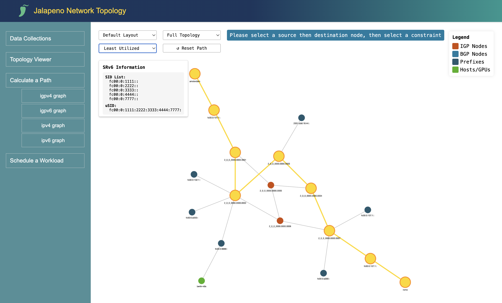
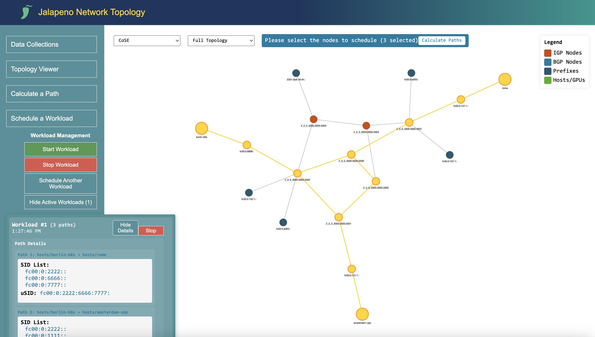

## Lab 5: Project Jalapeno and Host-Based SRv6 [30 Min]

### Description
In Lab 5 we will explore the power of SRv6 as a truly end-to-end technology through host-based SRv6, and with the help of the open-source Jalapeno platform. Jalapeno is designed to run on Kubernetes (K8s), which allows for easy integration into existing environments and supports deployment on bare metal, VMs, or in a public cloud. Kubernetes experience is not required for this lab as K8s has been preinstalled on the Jalapeno VM and we have included the required *kubectl* validation commands. We've also included a brief guide to installing Kubernetes on your own host or VM: [K8s Install Instructions](lab_4/k8s-install-instructions.md).

This lab is divided into two main sections :
* **Part 1:** Exploring the Jalapeno platform and a *`databases and APIs`* approach to SDN topology modeling
* **Part 2:** Giving applications or workloads the ability to control their own SRv6 paths through the use of *`host-based SRv6`*


## Contents
- [Lab 5: Project Jalapeno and Host-Based SRv6 \[30 Min\]](#lab-5-project-jalapeno-and-host-based-srv6-30-min)
  - [Description](#description)
- [Contents](#contents)
- [Lab Objectives](#lab-objectives)
- [Jalapeno Overview](#jalapeno-overview)
  - [Jalapeno Architecture and Data Flow](#jalapeno-architecture-and-data-flow)
- [Lab 5 Part 1: Project Jalapeno](#lab-5-part-1-project-jalapeno)
- [BGP Monitoring Protocol (BMP)](#bgp-monitoring-protocol-bmp)
- [Exploring Jalapeno](#exploring-jalapeno)
  - [Optional: Explore Kafka Topics](#optional-explore-kafka-topics)
  - [Jalapeno Arango Graph Database](#jalapeno-arango-graph-database)
  - [ArangoDB Query Language (AQL)](#arangodb-query-language-aql)
  - [Install Jalapeno Graph Processors](#install-jalapeno-graph-processors)
  - [BGP SRv6 locator](#bgp-srv6-locator)
  - [Populating the DB with external data](#populating-the-db-with-external-data)
- [Jalapeno REST API](#jalapeno-rest-api)
- [Jalapeno Web UI](#jalapeno-web-ui)
  - [Data Collections](#data-collections)
  - [Topology Viewer](#topology-viewer)
  - [Calculate a Path](#calculate-a-path)
  - [Schedule a Workload](#schedule-a-workload)
- [Path Calculation Use Cases:](#path-calculation-use-cases)
  - [Lowest Latency Path](#lowest-latency-path)
  - [Lowest Bandwidth Utilization Path](#lowest-bandwidth-utilization-path)
  - [Data Sovereignty Path](#data-sovereignty-path)
- [End of lab 5 Part 1](#end-of-lab-5-part-1)

## Lab Objectives
The student upon completion of Lab 5 should have achieved the following objectives:

* Understanding and configuration of BMP
* A tour of the Jalapeno platform and high level understanding of how it collects and processes data
* Familiarity with the ArangoDB UI and the BMP/BGP data collections the system has created
* Basic introduction to Arango Query Language (AQL) syntax
* Familiarity with the Jalapeno API and UI

## Jalapeno Overview
Project Jalapeno combines existing open source tools with some new stuff we've developed into a data collection and warehousing infrastructure intended to enable development of network service applications. Think of it as applying microservices architecture and concepts to SDN: give developers the ability to quickly and easily build microservice control planes on top of a common data infrastructure. More information on Jalapeno can be found at the Jalapeno Git repository: 

[Jalapeno on Cisco-Open Github](https://github.com/cisco-open/jalapeno/blob/main/README.md)

### Jalapeno Architecture and Data Flow


Jalapeno breaks the data collection and warehousing problem down into a series of components and services:
- **Data Collector** services such as GoBMP and Telegraf collect network topology and statistics and publish to Kafka
- **Data Processor** services such as "Topology", and the "Graph" services we'll deploy in this lab, subscribe to Kafka topics and write the data they receive to databases
- **Kafka** is used as a message bus between Collectors and Processors
- **Arango GraphDB** is used for modeling topology data
- **InfluxDB** is used for warehousing statistical time-series data
- **Grafana**: is used for visualizing the Influx time-series data and supports user creation of custom dashboards (not currentlyused in this lab)
- **REST API**: is used as a communication layer between the Jalapeno UI and external applications or clients, and the Jalapeno GraphDB
- **Jalapeno UI**: is a web application that allows users to interact with the Jalapeno topology model and path calculation tools. Note: the UI is still a work in progress, so not all functionality is available yet.

One of the primary goals of the Jalapeno project is to be flexible and extensible. In the future we expect Jalapeno could support any number of data collectors and processors. For example there could be a collector/processor pair that creates an LLDP Topology model in the graphDB. Netflow data could be incorporated via a future integration with a tool like [pmacct](http://www.pmacct.net/). Or an operator might already have a telemetry stack and could choose to selectively integrate Jalapeno's GoBMP/Topology/GraphDB modules into an existing environment running Kafka. We also envision future integrations with other API-driven data warehouses such as Cisco ThousandEyes: https://www.thousandeyes.com/

## Lab 5 Part 1: Project Jalapeno 

The Jalapeno package is preinstalled and running on the **Jalapeno** VM (198.18.128.101).

1. SSH to the Jalapeno VM and verify k8s pods are running. For those students new to Kubernetes you can reference this cheat sheet [HERE](https://kubernetes.io/docs/reference/kubectl/cheatsheet/)  

    ```
    ssh cisco@198.18.128.101
    ```

    - verify k8s pods
    ```
    kubectl get pods -A
    ```
    The output should look something like the following. Note that the Jalapeno VM is also using Cilium as its CNI, and that all of the Jalapeno pods/microservices are running in the **jalapeno** namespace.  Also, the Jalapeno K8s cluster is completely independent of the K8s cluster on the Berlin VM. In our simulation the Berlin VM is a consumer of services on our SRv6 network, which may include services that are accessed by interacting with Jalapeno.

    ```yaml
    cisco@jalapeno:~/jalapeno/install$ kubectl get pods -A
    NAMESPACE     NAME                                           READY   STATUS    RESTARTS         AGE
    jalapeno      arangodb-0                                     1/1     Running   0                86s
    jalapeno      gobmp-5db68bd644-dgg7w                         1/1     Running   1 (44s ago)      78s
    jalapeno      grafana-deployment-565756bd74-d26pj            1/1     Running   0                86s
    jalapeno      influxdb-0                                     1/1     Running   0                86s
    jalapeno      jalapeno-api-5d8469557-gpz8j                   1/1     Running   0                85s
    jalapeno      jalapeno-ui-54f8f95c5d-pn79v                   1/1     Running   0                84s
    jalapeno      kafka-0                                        1/1     Running   0                87s
    jalapeno      lslinknode-edge-b954577f9-w46gf                1/1     Running   3 (53s ago)      72s
    jalapeno      telegraf-egress-deployment-5795ffdd9c-7xjj4    1/1     Running   0                73s
    jalapeno      telegraf-ingress-deployment-5b456574dc-vlnvq   1/1     Running   0                79s
    jalapeno      topology-678ddb8bb4-klzmt                      1/1     Running   1 (41s ago)      73s
    jalapeno      zookeeper-0                                    1/1     Running   0                87s
    kube-system   cilium-k8fht                                   1/1     Running   3 (4h41m ago)    363d
    kube-system   cilium-operator-6f5db4f885-nmpwb               1/1     Running   3 (4h41m ago)    363d
    kube-system   coredns-565d847f94-nmt4n                       1/1     Running   0                4h40m
    kube-system   coredns-565d847f94-sg8fl                       1/1     Running   3 (4h41m ago)    363d
    kube-system   etcd-jalapeno                                  1/1     Running   19 (4h41m ago)   363d
    kube-system   kube-apiserver-jalapeno                        1/1     Running   3 (4h41m ago)    363d
    kube-system   kube-controller-manager-jalapeno               1/1     Running   3 (4h41m ago)    363d
    kube-system   kube-proxy-g8nbn                               1/1     Running   3 (4h41m ago)    363d
    kube-system   kube-scheduler-jalapeno                        1/1     Running   3 (4h41m ago)    363d
    ```

2. Display only the pods in the jalapeno namespace:
    ```
    kubectl get pods -n jalapeno
    ```
    Output will look something like:
    ```yaml
    cisco@jalapeno:~$ kubectl get pods -n jalapeno
    NAME                                          READY   STATUS    RESTARTS      AGE
    arangodb-0                                    1/1     Running   0             39m     # Arango GraphDB
    gobmp-5db68bd644-p8r24                        1/1     Running   1 (90s ago)   38m     # GoBMP Collector
    grafana-deployment-565756bd74-nmp6g           1/1     Running   0             39m     # Grafana
    influxdb-0                                    1/1     Running   0             39m     # Influx Time-Series DB
    jalapeno-api-5d8469557-w4dcm                  1/1     Running   0             39m     # Jalapeno REST API
    jalapeno-ui-54f8f95c5d-9vns7                  1/1     Running   0             39m     # Jalapeno UI
    kafka-0                                       1/1     Running   0             39m     # Kafka
    lslinknode-edge-b954577f9-jmkn4               1/1     Running   3 (38m ago)   39m     # LS Link & Node Processor
    telegraf-egress-deployment-5795ffdd9c-8lpd4   1/1     Running   0             39m     # Telegraf Egress Processor
    telegraf-ingress-deployment-5b456574dc-cxt9v  1/1     Running   0             38m     # Telegraf Ingress Collector
    topology-678ddb8bb4-4kmq8                     1/1     Running   1 (38m ago)   39m     # BMP Topology Processor
    zookeeper-0                                   1/1     Running   0             39m     # Zookeeper
    ```

3. Optional: here are some additional k8s commands to try. Note the different outputs when specifying a particular namespace (-n option) vs. all namespaces (-A option):
    ```yaml
    kubectl get pods -n jalapeno                      # display all pods/containers in the Jalapeno namespace
    kubectl get pods -n jalapeno-collectors           # display all pods/containers in the Jalapeno-Collectors namespace
    kubectl get services -A                           # display all externally reachable services (BMP, Arango, etc.)
    kubectl get all -A                                # display a summary of all cluster info
    kubectl get nodes                                 # display cluster node info
    kubectl describe pod -n <namespace> <pod name>    # display detailed info about a pod

    example: kubectl describe pod -n jalapeno topology-678ddb8bb4-rt9jg
    ```

## BGP Monitoring Protocol (BMP)

Most transport SDN systems use BGP-LS to gather and model the underlying IGP topology. Jalapeno is intended to be a more generalized data platform to support development of all sorts of use cases such as VPNs or service chains. Because of this, Jalapeno's primary method of capturing topology data is via BMP. BMP provides all BGP AFI/SAFI info including BGP-LS, thus Jalapeno is able to model many different kinds of topologies, including the topology of the Internet (at least from the perspective of our peering routers).

So we're going to take a brief step back and do some more router configuration. We'll first establish a BMP session between our route-reflectors and the open-source GoBMP collector, which comes pre-packaged with the Jalapeno install. We'll then enable BMP monitoring of the RRs' BGP peering sessions with our PE routers **xrd01** and **xrd07**. Once established, the RRs' will stream all BGP NLRI info they receive from the PE routers to the GoBMP collector, and the BGP data will flow up the Jalapeno stack into the graph database. 

Reference: the GoBMP Git Repository can be found [HERE](https://github.com/sbezverk/gobmp)

1. BMP configuration on **xrd05** and **xrd06**:
    ```
    conf t
    bmp server 1
      host 198.18.128.101 port 30511
      description jalapeno GoBMP  
      update-source MgmtEth0/RP0/CPU0/0
      flapping-delay 60
      initial-delay 5
      stats-reporting-period 60
      initial-refresh delay 25 spread 2
    
    router bgp 65000
      neighbor 10.0.0.1
        bmp-activate server 1
    
      neighbor fc00:0000:1111::1
        bmp-activate server 1

      neighbor 10.0.0.7
        bmp-activate server 1
    
      neighbor fc00:0000:7777::1
        bmp-activate server 1

      neighbor fc00:0000:8888::1
        bmp-activate server 1
        
    commit
    ```

2. Validate BMP session establishment and client monitoring (the session may take a couple minutes to become active/established):
    ```
    show bgp bmp summary
    ```

    Expected output:  
    ```
    RP/0/RP0/CPU0:xrd06#show bgp bmp sum
    Sat Dec 16 03:19:26.045 UTC
    ID   Host                 Port     State   Time        NBRs
    1   198.18.128.101       30511    ESTAB   00:00:07    4   
    RP/0/RP0/CPU0:xrd06#

    ```

## Exploring Jalapeno

### Optional: Explore Kafka Topics 

Jalapeno uses the very popular Kafka messaging bus to transport data received from the network to data processors which map it into the graph database. We've included a brief guide to exploring the Jalapeno Kafka setup including listing and monitoring topics: 

[Explore Kafka on Jalapeno](lab_5/lab_5-kafka.md)

This element of the lab is completely optional, however, because this lab guide is published on Github, you can come back to it in the future to explore Kafka on your own.

### Jalapeno Arango Graph Database
At the heart of Jalapeno is the Arango Graph Database, which is used to model network topology and provide a graph-based data store for the network data collected via BMP or other sources. 

1. Validate Jalapeno has populated the Arango graphDB with BMP data. Open the Arango web UI at:

    ```
    http://198.18.128.101:30852/
    ```
    - Login and select the "jalapeno" DB from the dropdown:
    ```
    user: root
    password: jalapeno
    DB: jalapeno
    ```
    Once logged the UI should then show you its 'collections' view, which should look something like:

  

2. Feel free to spot check the various data collections in Arango. Several will be empty as they are for future use. With successful BMP processing we would expect to see data in all the following collections:

    - l3vpn_v4_prefix
    - l3vpn_v6_prefix
    - ls_link
    - ls_node
    - ls_node_edge
    - ls_prefix
    - ls_srv6_sid
    - peer
    - unicast_prefix_v4
    - unicast_prefix_v6

### ArangoDB Query Language (AQL)

The ArangoDB Query Language (AQL) can be used to retrieve and modify data that are stored in ArangoDB.

The general workflow when executing a query is as follows:

- A client application ships an AQL query to the ArangoDB server. The query text contains everything ArangoDB needs to compile the result set

- ArangoDB will parse the query, execute it and compile the results. If the query is invalid or cannot be executed, the server will return an error that the client can process and react to. If the query can be executed successfully, the server will return the query results (if any) to the client. See ArangoDB documentation [HERE](https://www.arangodb.com/docs/stable/aql/index.html)


1. Run some DB Queries (one the left side of the Arango UI click on Queries):
    
    For the most basic query below *x* is a object variable with each key field in a record populated as a child object. So basic syntax can be thought of as:

    *`for x in <collection_name> return x `*

    ```
    for x in ls_node return x
    ```
    This query will return ALL records in the *`ls_node`* collection. In our lab topology you should expect 7 records. 


    Next lets get the AQL to return only the *`key:value`* field we are interested in. We will query the name of all nodes in the *`igp_node`* collection with the below query. To reference a specific key field we use use the format **x.key** syntax.

     - Note: after running a query you will need to either comment it out or delete it before running the next query. To comment-out use two forward slashes *`//`* as shown in this pic:


    


    ```
    for x in igp_node return x.name
    ```
    Expected output from Arango query:
    ```   
    "xrd01",
    "xrd02",
    "xrd03",
    "xrd04",
    "xrd05",
    "xrd06",
    "xrd07"
    ```

2. Optional or for reference: feel free to try a number of additional queries in the lab_5-queries.md doc [Here](https://github.com/jalapeno/SRv6_dCloud_Lab/tree/main/lab_5/lab_5-queries.md)

### Install Jalapeno Graph Processors
Jalapeno's base installation includes the Topology and Link-State data processors. We have since written some addtitional processors which mine the existing data collections and create enriched topology models or graphs. We'll add these additional processors to our Jalapeno K8s cluster via a simple shell script.
   
1. ssh to Jalapeno VM, cd to the lab_5/graph-processors directory, and run the deploy.sh script:
    ```
    ssh cisco@198.18.128.101

    cd ~/SRv6_dCloud_Lab/lab_5/graph-processors
    ./deploy.sh
    ```

The new processors will have created the following new collections in the Arango graphDB, feel free to explore them in the ArangoDB UI, or move on to the next section.

- *`igpv4_graph`*: a model of the ipv4 IGP topology including SRv6 SID data
- *`igpv6_graph`*: a model of the ipv6 IGP topology including SRv6 SID data
- *`ipv4_graph`*: a model of the entire ipv4 topology (IGP and BGP)
- *`ipv6_graph`*: a model of the entire ipv6 topology (IGP and BGP)
- *`sr_local_sids`*: a collection of SRv6 SIDs that are not automatically available via BMP. You may have noticed in the xrd routers' streaming telemetry configuration we have added the YANG path for XR to stream all SRv6 SIDs to Jalapeno's Telegraf telemetry collector.
  
2. Verify the Graph Processors have deployed successfully:
    ```
    kubectl get pods -n jalapeno
    ```

    Expected (truncated) output::
    ```
    igp-graph-5f7fcd6f88-8xqxr                     1/1     Running   0              53s
    ipv4-graph-7ccc46bc57-xzjnk                    1/1     Running   0              53s
    ipv6-graph-56db757fc9-kgbbg                    1/1     Running   0              52s
    srv6-localsids-78c644bc76-ccpwh                1/1     Running   0              52s
    ```

### BGP SRv6 locator
In lab 1 we configured an SRv6 locator for the BGP global/default table. When we get to *`lab 5 Part 2`* we'll use these locators as we'll be sending SRv6 encapsulated traffic directly to/from the Amsterdam and Rome VMs. With our endpoints performing SRv6 encapsulation our BGP SRv6 locator will provide the end.DT4/6 function at the egress nodes **xrd01** and **xrd07** to be able to pop the SRv6 encap and perform a global table lookup on the underlying payload.

1. Optional: ssh to **xrd01** and re-validate end.DT4/6 SIDs belonging to BGP default table:
    ```
    ssh cisco@clab-cleu25-XR01
    show segment-routing srv6 sid
    ```

    Expected (truncated)output on **xrd01** should look something like the below table with both a uDT4 and uDT6 SID in the 'default' context:  
    ```
    fc00:0:1111:e004::          uDT4              'default'                         bgp-65000           InUse  Y 
    fc00:0:1111:e006::          uDT6              'default'                         bgp-65000           InUse  Y
    ``` 

  - As we saw earlier in the lab, the *`kubectl get pods -n jalapeno`* command will show you all the k8s containers that make up the Jalapeno application, including the *`srv6-localsids`* processor. This processor harvests SRv6 SID data from a Kafka streaming telemetry topic and populates it in the *`sr_local_sids`* collection in ArangoDB.  
  
    Example:

    ```
    SID                         Behavior          Context                    Owner              
    ----------------------  --------------  -----------------------------  ------------
    fc00:0:1111::           uN (PSP/USD)    'default':4369                 sidmgr     <-------- Collected via BMP
    fc00:0:1111:e000::      uA (PSP/USD)    [Gi0/0/0/1, Link-Local]:0:P    isis-100    <---|   
    fc00:0:1111:e001::      uA (PSP/USD)    [Gi0/0/0/1, Link-Local]:0      isis-100    <---|  These are not available via BMP
    fc00:0:1111:e002::      uA (PSP/USD)    [Gi0/0/0/2, Link-Local]:0:P    isis-100    <---|  We collect and process
    fc00:0:1111:e003::      uA (PSP/USD)    [Gi0/0/0/2, Link-Local]:0      isis-100    <---|  these SIDs via streaming
    fc00:0:1111:e004::      uDT4            'carrots'                      bgp-65000   <---|  telemetry and the 
    fc00:0:1111:e005::      uDT6            'carrots'                      bgp-65000   <---|  "srv6-localsids" processor

    ```
  > [!NOTE]
  > The SRv6 SID streaming telemetry configuration for capturing *`xrd07's`* srv6 sid data can be seen here: [SRv6 SID mdt path](https://github.com/jalapeno/SRv6_dCloud_Lab/blob/main/lab_1/config/xrd07.cfg#L23)

 
### Populating the DB with external data 

In preparation for our Host-Based SRv6 use cases we need to populate the DB with meta-data that we will use for upcoming path calculation API calls.

The [add_meta_data.py](python/add_meta_data.py) python script will connect to the ArangoDB and populate elements in our data collections with addresses and country codes. Also, due to the fact that we can't run realistic traffic through the XRd topology the script will populate the relevant graphDB elements with synthetic *link latency* and *outbound link utilization* data per this diagram:


1. Return to the ssh session on the Jalapeno VM and add meta data to the DB. 
   ```
   cd ~/SRv6_dCloud_Lab/lab_5/python/
   python3 add_meta_data.py
   ```
   Expected output:
   ```
   cisco@jalapeno:~/SRv6_dCloud_Lab/lab_5/python$ python3 add_meta_data.py
   adding hosts, addresses, country codes, and synthetic latency data to the graph
   adding location, country codes, latency, and link utilization data
   meta data added
   Successfully inserted/updated 3 hosts records
   Successfully inserted/updated 4 IPv4 edge records
   Successfully inserted/updated 6 IPv6 edge records
   ```

2. Validate meta data with a query in the ArangoDB UI:
   ```
   for x in ipv4_graph return { key: x._key, from: x._from, to: x._to, latency: x.latency, 
    utilization: x.percent_util_out, country_codes: x.country_codes }
   ```

   Example Output:
   
   
> [!NOTE]
> Only the ISIS links in the DB have latency and utilization numbers. The Amsterdam and Rome VMs are directly connected to PEs **xrd01** and **xrd07**, so their "edge connections" in the DB are effectively zero latency. 
  
> [!NOTE]
> The *`add_meta_data.py`* script has also populated country codes for all the countries a given link traverses from one node to its adjacent peer. Example: **xrd01** is in Amsterdam, and **xrd02** is in Berlin. Thus the **xrd01** <--> **xrd02** link traverses *`[NLD, DEU]`*


## Jalapeno REST API
The Jalapeno REST API is used to run queries against the ArangoDB and retrieve graph topology data or execute shortest path calculations. 

1. Test the Jalapeno REST API:

   - From the ssh session on the Jalapeno VM or the XRD VM (or the command line on your local machine) validate the Jalapeno REST API is running:
    ```
    curl http://198.18.128.101:30800/api/v1/collections
    ```
    ```
    curl http://198.18.128.101:30800/api/v1/collections/ls_node
    ```
    -  If you run your curl commands from the Jalapeno VM we installed the *`jq`* tool to help with nicer JSON parsing:
    ```
    curl http://198.18.128.101:30800/api/v1/graphs/igpv4_graph/vertices/keys | jq .
    ```
    ```
    curl http://198.18.128.101:30800/api/v1/graphs/igpv4_graph/edges | jq .
    ```

   - The API also has auto-generated documentation at: [http://198.18.128.101:30800/docs/](http://198.18.128.101:30800/docs/) 


## Jalapeno Web UI

The Jalapeno UI is very much a work in progress and is meant to illustrate the potential use cases for extending SRv6 services beyond traditional network elements and into the server, host, VM, k8s, or other workloads or endpoints. Once Jalapeno has programmatically collected data from the network and it built its topology graphs, the network operator has complete flexibility to add data or augment the graph as we saw in the previous section. From there its not too difficult to conceive of building network services based on calls to the Jalapeno API and leveraging the SRv6 uSID stacks that are returned.

Each lab instance has a Jalapeno Web UI that can be accessed at the following URL: [http://198.18.128.101:30700](http://198.18.128.101:30700). 

On the left hand sidebar you will see that UI functionality is split into four sections:

- **Data Collections**: explore raw object and graph data collected from the network.
- **Topology Viewer**: explore the network topology graphs built by Jalapeno and based on BMP data received from the network.
- **Calculate a Path**: gives the user the ability to select a source and destination in the graph and calculate the best path through the network based upon a selected constraint.
- **Schedule a Workload**: this function is still under construction. The idea behind `Schedule a Workload` is to have a fabric load-balancing service.

### Data Collections
Currently populated with raw BMP data and graph data. We have placeholders for future data collections such as Services (like firewalls or load balancers), Hosts, and GPUs.


### Topology Viewer
Prompts the user to select a graph from the dropdown and then displays the graph in the center of the screen. The graph is interactive and the user can hover over a node to see more information about it. There are also dropdowns to change the graph's layout and to show a 'nodes-only' view. Funally the user can click on nodes along a path and the relevant SRv6 uSID stack will be displayed in the upper right corner of the screen.


### Calculate a Path
This function gives the user the ability to select a source and destination in the graph and calculate the best path through the network based upon a selected constraint. The calculated path will light up and the application will display the relevant SRv6 uSID stack. The path calculation algorithms on the backend are using the telemetry meta data we uploaded in Part 1. In a future release we hope to incorporate streaming telemetry data into the graph and include it in path calculations.




### Schedule a Workload
This function is still under construction. The idea behind `Schedule a Workload` is to have a fabric load-balancing service where the user can select a set of endpoints, such as hosts or even GPUs, then ask Jalapeno to calculate a set of paths based on each source/destination pair of the selected endpoints. Jalapeno would return a set of uSIDs that would evenly balance the source/destination flows across available paths in the fabric.




## Path Calculation Use Cases: 

### Lowest Latency Path

Our first use case is to make path selection through the network based on the cummulative link latency from A to Z. Calculating best paths using latency meta-data is not something traditional routing protocols can do. It may be possible to statically build routes through your network using weights to define a path. However, what these workarounds cannot do is provide path selection based on near real time data which is possible with an application like Jalapeno. This provides customers to have a flexible network policy that can react to changes in the WAN environment.

In this use case we want to idenitfy the lowest latency path for traffic originating from the *`Amsterdam VM`* destined to *`Rome VM`*. The UI makes an API call to trigger Arango's shortest path query capabilities and specify latency as our *weighted attribute* pulled from the meta-data. 

### Lowest Bandwidth Utilization Path

In this use case we want to identify the least utilized path for traffic originating from the *`Amsterdam VM`* destined to *`Rome VM`*. The API call will specify link utilization as our *weighted attribute* pulled from the meta-data. 

From the UI select *`Amsterdam`* as the source and the *`Rome`* as the destination. Then select *Least Utilized* from the constraints dropdown. The Least Utilized path will be highlighted and uSID stack will appear in the popup.

  1. If we wanted to implement the returned query data into SRv6-TE steering XR config on router **xrd01** we would create a policy like the below example.
     
  2. Optional: on router **xrd07** add in config to advertise the global prefix with the bulk transfer community.
     ```
     extcommunity-set opaque bulk-transfer
       40
     end-set

     route-policy set-global-color
        if destination in (10.107.1.0/24) then
          set extcommunity color bulk-transfer
        endif
        pass
     end-policy 
     ```
  3. On router **xrd01** we would add an SRv6 segment-list config to define the hops returned from our query between router **xrd01** (source) and **xrd07** (destination). 
   
      ```
      segment-routing
        traffic-eng
          segment-lists
            segment-list xrd567
              srv6
               index 10 sid fc00:0:2222::
               index 20 sid fc00:0:3333::
               index 30 sid fc00:0:4444:: 

          policy bulk-transfer
           srv6
            locator MyLocator binding-sid dynamic behavior ub6-insert-reduced
           !
           color 40 end-point ipv6 fc00:0:7777::1
           candidate-paths
            preference 100
             explicit segment-list xrd2347
      ```
> [!NOTE]
> The xrd01 configuration was applied in Lab 3 and is shown here for informational purposes only.
  
### Data Sovereignty Path

In this use case we want to idenitfy a path originating from *`Amsterdam`* destined to *`Rome`* that avoids passing through France (perhaps there's a toll on the link). The API call will utilize Arango's shortest path query capability and filter out results that pass through **xrd06** based in Paris, France. 

From the UI select *`Amsterdam`* as the source and the *`Rome`* as the destination. Then select *Data Sovereignty* from the constraints dropdown. The Data Sovereignty path will be highlighted and uSID stack will appear in the popup.
   1. Return to the ArangoDB browser UI and run a shortest path query from *10.101.1.0/24* to *20.0.0.0/24* , and have it return SRv6 SID data.
      ```
      for p in outbound k_shortest_paths  'ibgp_prefix_v4/10.101.1.0_24' 
          TO 'ibgp_prefix_v4/20.0.0.0_24' ipv4_graph 
            options {uniqueVertices: "path", bfs: true} 
            filter p.edges[*].country_codes !like "FRA" limit 1 
                return { path: p.vertices[*].name, sid: p.vertices[*].sids[*].srv6_sid, 
                    countries_traversed: p.edges[*].country_codes[*], latency: sum(p.edges[*].latency), 
                        percent_util_out: avg(p.edges[*].percent_util_out)} 
      ```

## End of lab 5 Part 1
Please proceed to [Lab 5 Part 2: Host-Based SRv6](lab_5-guide2.md)
