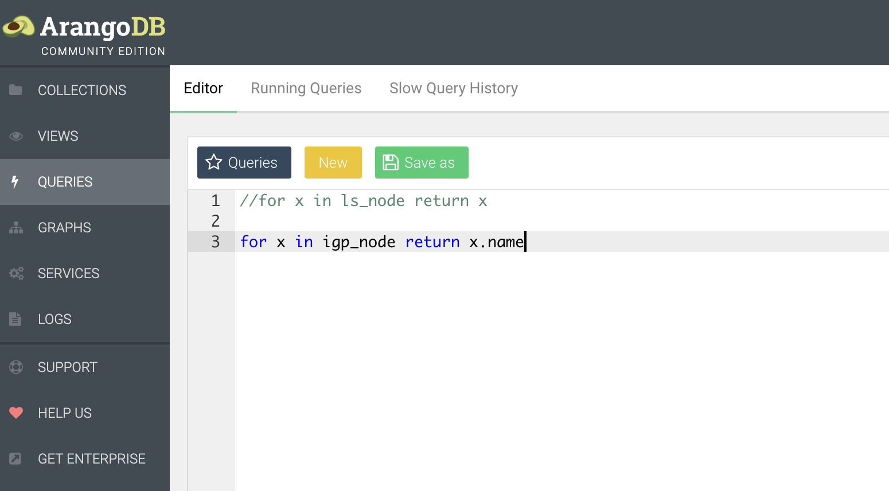

## Lab 5: Exploring Jalapeno, Kafka, and ArangoDB [30 Min]

### Description
In Lab 5 we will explore elements of the Jalapeno system. We will log into the Kafka container and monitor topics for data coming in from Jalapeno's data collectors. Data which is subsequently picked up by Jalapeno's data processors and written to the Arango graphDB. We will spend some time getting familiar with ArangoDB and the Jalapeno data collections.

At the end of this lab we will explore the power of coupling the meta-data gathered into Jalapeno coupled with SRv6. We will demonstrate three service use cases which are not possible with classic MPLS networks.

## Contents
- [Lab 5: Exploring Jalapeno, Kafka, and ArangoDB \[30 Min\]](#lab-5-exploring-jalapeno-kafka-and-arangodb-30-min)
  - [Description](#description)
- [Contents](#contents)
- [Lab Objectives](#lab-objectives)
- [Jalapeno Software Stack](#jalapeno-software-stack)
- [Kafka](#kafka)
  - [Kafka Intro](#kafka-intro)
  - [Kafka Topics](#kafka-topics)
  - [Arango GraphDB](#arango-graphdb)
  - [Populating the DB with external data](#populating-the-db-with-external-data)
  - [Use Case 1: Lowest Latency Path](#use-case-1-lowest-latency-path)
    - [SRv6-TE for XR Global Routing Table](#srv6-te-for-xr-global-routing-table)
  - [Use Case 2: Lowest Bandwidth Utilization Path](#use-case-2-lowest-bandwidth-utilization-path)
  - [Use Case 3: Data Sovereignty Path](#use-case-3-data-sovereignty-path)
  - [End of lab 5](#end-of-lab-5)

## Lab Objectives
The student upon completion of Lab 5 should have achieved the following objectives:

* A tour of the Jalapeno platform and high level understanding of how it collects and processes data
* Familiarity with Kafka and Kafka's command line utilities
* Familiarity with the ArangoDB UI and the BMP/BGP data collections the system has created
* Familiarity with Arango Query Language (AQL) syntax
* Familiarity with more complex Arango shortest-path and graph traversal queries

## Jalapeno Software Stack
 

## Kafka
### Kafka Intro
From the Kafka [homepage](https://kafka.apache.org/): Apache Kafka is an open-source distributed event streaming platform used by thousands of companies for high-performance data pipelines, streaming analytics, data integration, and mission-critical applications.

Jalapeno uses Kafka as a message bus between its data collectors and data processors. Jalapeno's data collectors create Kafka topics then publish their datasets to those topics. The data processors subscribe to the relevant Kafka topics, gather the published data, and write it to either the Arango graphDB or Influx Time-Series DB. This `Collector -> Kafka -> Processor -> DB` pipeline allows for architectural flexibility and extensibility such that other applications could subscribe to the Jalapeno Kafka topics and use the BMP or telemetry data for their own purposes.

Kafka has a number of built in command line utilities to do things like listing topics or outputting of topic data to the screen, which we'll do in the next section of the lab. 

For additional help on Kafka see this external CLI cheat sheet [HERE](https://medium.com/@TimvanBaarsen/apache-kafka-cli-commands-cheat-sheet-a6f06eac01b)


### Kafka Topics 

1. In a separate terminal session ssh to the Jalapeno VM 
    ```
    cisco@198.18.128.101
    pw = cisco123
    ```

2. Login to the Kafka container and cd into the bin directory. 
    ```
    kubectl exec -it kafka-0 -n jalapeno -- /bin/bash

    cd bin
    ls -la
    ```

3. The Jalapeno deployment of Kakfa includes enablement of JMX (Java Management Extensions), which allows for monitoring of Kafka elements such as brokers, topics, Zookeeper, etc. To operate the CLI utilies we'll need to unset the JMX_PORT:  
    ```
    unset JMX_PORT
    ```

4. Run the CLI utility to get a listing of all Kafka topics in our cluster:
    ```
    ./kafka-topics.sh --list  --bootstrap-server localhost:9092
    ```
    - A few seconds after running the *--list* command you should see the following list of topics toward the bottom on the command output. See truncated output below.

    ```
    gobmp.parsed.evpn
    gobmp.parsed.evpn_events
    gobmp.parsed.l3vpn
    gobmp.parsed.l3vpn_events
    gobmp.parsed.l3vpn_v4
    gobmp.parsed.l3vpn_v4_events
    gobmp.parsed.l3vpn_v6
    gobmp.parsed.l3vpn_v6_events
    gobmp.parsed.ls_link
    gobmp.parsed.ls_link_events
    gobmp.parsed.ls_node
    gobmp.parsed.ls_node_events
    gobmp.parsed.ls_prefix
    gobmp.parsed.ls_prefix_events
    gobmp.parsed.ls_srv6_sid
    gobmp.parsed.ls_srv6_sid_events
    gobmp.parsed.peer
    gobmp.parsed.peer_events
    gobmp.parsed.unicast_prefix
    gobmp.parsed.unicast_prefix_events
    gobmp.parsed.unicast_prefix_v4
    gobmp.parsed.unicast_prefix_v4_events
    gobmp.parsed.unicast_prefix_v6
    gobmp.parsed.unicast_prefix_v6_events
    jalapeno.ipv4_graph_events
    jalapeno.ipv6_graph_events
    jalapeno.linkstate_edge_v4_events
    jalapeno.linkstate_edge_v6_events
    jalapeno.ls_node_edge_events
    jalapeno.srv6
    jalapeno.telemetry
    ```
### Arango GraphDB

1. Switch to a web browser and connect to Jalapeno's Arango GraphDB
    ```
    http://198.18.128.101:30852/
    ```
    ```
    user: root
    password: jalapeno
    DB: jalapeno
    ```
2. Spend some time exploring the data collections in the DB

    #### Basic queries to explore data collections 
    The ArangoDB Query Language (AQL) can be used to retrieve and modify data that are stored in ArangoDB.

    The general workflow when executing a query is as follows:

    - A client application ships an AQL query to the ArangoDB server. The query text contains everything ArangoDB needs to compile the result set

    - ArangoDB will parse the query, execute it and compile the results. If the query is invalid or cannot be executed, the server will return an error that the client can process and react to. If the query can be executed successfully, the server will return the query results (if any) to the client. See ArangoDB documentation [HERE](https://www.arangodb.com/docs/stable/aql/index.html)


3. Run some DB Queries (one the left side of the Arango UI click on Queries):
    
    For the most basic query below *x* is a object variable with each key field in a record populated as a child object. So basic syntax can be thought of as:

    *`for x in <collection_name> return x `*

    ```
    for x in ls_node return x
    ```
    This query will return ALL records in the *`ls_node`* collection. In our lab topology you should expect 7 records. 

     - Note: after running a query you will need to either comment it out or delete it before running the next query. To comment-out use two forward slashes *`//`* as shown in this pic:

    

    Next lets get the AQL to return only the *`key:value`* field we are interested in. We will query the name of all nodes in the *`igp_node`* collection with the below query. To reference a specific key field we use use the format **x.key** syntax.
    ```
    for x in igp_node return x.name
    ```
    Expected output from Arango query:
    ```   
    "xrd01",
    "xrd02",
    "xrd03",
    "xrd04",
    "xrd05",
    "xrd06",
    "xrd07"
    ```
    If we wish to return multiple keys in our query we will switch to using curly braces to ask for a data set in the return. In this case we are quering the name to return the record only for **xrd01**
    ```
    for x in igp_node 
        filter x.name == "xrd04"
    return {Name: x.name, SID: x.sids}
    ```

    Truncated output:
    ```
    {
        "Name": "xrd04",
        "SID": [
        {
            "srv6_sid": "fc00:0:4444::",
            "srv6_endpoint_behavior": {
            "endpoint_behavior": 48,
            "flag": 0,
            "algo": 0
            },
            "srv6_sid_structure": {
            "locator_block_length": 32,
            "locator_node_length": 16,
            "function_length": 0,
            "argument_length": 80
            }
        }
        ]
    }
    ```

    Now if you want to filter on multiple conditions we can through a boolean value in to return the **xrd01** and **xrd07** records.
    ```
    for x in igp_node 
        filter x.name == "xrd01" or x.name=="xrd07"
    return {Name: x.name, SID: x.sids}
    ```

4. Optional or for reference: feel free to try a number of additional queries in the lab_5-queries.md doc [Here](https://github.com/jalapeno/SRv6_dCloud_Lab/tree/main/lab_5/lab_5-queries.md)
    
 
### Populating the DB with external data 

In preparation for our service use cases we need to populate Jalapeno with meta-data that you will use to form complex queries.

The *`add_meta_data.py`* python script will connect to the ArangoDB and populate elements in our data collections with addresses and country codes. Also, due to the fact that we can't run realistic traffic through the XRd topology the script will populate the relevant graphDB elements with synthetic link latency and outbound link utilization data per this diagram:


1. Return to the ssh session on the Jalapeno VM and add meta data to the DB. Note, if your Jalapeno VM session is still attached to Kakfa, type *`'ctrl-z'`* then type *`'exit'`*:
   ```
   cd ~/SRv6_dCloud_Lab/lab_5/python/
   python3 add_meta_data.py
   ```
   Expected output:
   ```
   cisco@jalapeno:~/SRv6_dCloud_Lab/lab_5/python$ python3 add_meta_data.py
   adding addresses, country codes, and synthetic latency data to the graph
   adding location, country codes, latency, and link utilization data
   meta data added
   ```

2. Validate meta data with an ArangoDB query:
   ```
   for x in ipv4_graph return { key: x._key, from: x._from, to: x._to, latency: x.latency, 
    utilization: x.percent_util_out, country_codes: x.country_codes }
   ```

   Example Output:
   
   
> [!NOTE]
> Only the ISIS links in the DB have latency and utilization numbers. The Amsterdam and Rome VMs are directly connected to PEs **xrd01** and **xrd07**, so their "edge connections" in the DB are effectively zero latency. 
  
> [!NOTE]
> The *`add_meta_data.py`* script has also populated country codes for all the countries a given link traverses from one node to its adjacent peer. Example: **xrd01** is in Amsterdam, and **xrd02** is in Berlin. Thus the **xrd01** <--> **xrd02** link traverses *`[NLD, DEU]`*

### Use Case 1: Lowest Latency Path
Our first use case is to make path selection through the network based on the cummulative link latency from A to Z. Using latency meta-data is not something traditional routing protocols can do. It may be possible to statically build routes through your network using weights to define a path. However, what these work arounds cannot do is provide path selection based on near real time data which is possible with an application like Jalapeno. This provides customers to have a flexible network policy that can react to changes in the WAN environment.

> [!TIP]
> General Arango AQL graph query syntax information can be found [HERE](https://www.arangodb.com/docs/stable/aql/graphs.html). Please reference this document on the shortest path algorithim in AQL [HERE](https://www.arangodb.com/docs/stable/aql/graphs-shortest-path.html) (2 minute read).

In this use case we want to idenitfy the lowest latency path for traffic originating from the *`10.101.1.0/24`* (Amsterdam) destined to *`20.0.0.0/24`* (Rome). We will utilize Arango's shortest path query capabilities and specify latency as our weighted attribute pulled from the meta-data. See image below which shows the shortest latency path we expect to be returned by our query.
> [!NOTE]
> The *10.101.1.0/24* and *20.0.0.0/24* prefixes are in the global routing table, which is reflected in the query.


   1. Return to the ArangoDB browser UI and run a shortest path query from *10.101.1.0/24* to *20.0.0.0/24* , and have it return SRv6 SID data.
      ```
      for v, e in outbound shortest_path 'unicast_prefix_v4/10.101.1.0_24_10.0.0.1' 
          TO 'unicast_prefix_v4/20.0.0.0_24_10.0.0.7' ipv4_graph OPTIONS {weightAttribute: 'latency' } 
          return  { prefix: v.prefix, name: v.name, srv6sid: v.sids[*].srv6_sid, latency: e.latency }
      ```
   
   2. Examine the table output and it should match the expected path in the diagram above. See sample output below.
   

#### SRv6-TE for XR Global Routing Table
Now we will modify the configuration for **xrd07** to incorporate SRv6-TE policy for route 20.0.0.0/24. Lets log in and get configuring!

1. On router **xrd07** add in config to advertise the global prefix with the low latency community.
   ```
   conf t
   extcommunity-set opaque low-latency
     50
   end-set

   route-policy set-global-color
      if destination in (20.0.0.0/24) then
        set extcommunity color low-latency
      endif
      pass
   end-policy 
   commit
   ```
2. Add in BGP configuration to link the set-global-color policy to the ipv4 peering group
   ```
    router bgp 65000
     neighbor-group xrd-ipv4-peer
      address-family ipv4 unicast
       route-policy set-global-color out 
    commit
   ```
3. If we wanted to implement the returned query data into SRv6-TE steering config on router **xrd01** we would create a policy like the below example. 
   
> [!NOTE]
> We already created the segment-list and policy back in Lab 3, so now the policy will be re-used for steering global table traffic to *20.0.0.0/24*.
   
      For review, the below SRv6 segment-list would define the hops returned from our query between router **xrd01** (source) and **xrd07** (destination). The segment-list doesn't need to include *`fc00:0:7777::`* as **xrd07's** SRv6 uSID is automatically added as it represents the SRv6 policy endpoint.
      ```
      segment-routing
        traffic-eng
          segment-lists
            segment-list xrd567
              srv6
                index 10 sid fc00:0:5555::
                index 20 sid fc00:0:6666::
      ```
      Here is the accompanying SRv6-TE policy that connects the *extcommunity/color 50* to our segment list *xrd567*
      ```
      policy low-latency
        srv6
          locator MyLocator binding-sid dynamic behavior ub6-insert-reduced
   
        color 50 end-point ipv6 fc00:0:7777::1
        candidate-paths
          preference 100
            explicit segment-list xrd567
      ```

### Use Case 2: Lowest Bandwidth Utilization Path
In this use case we want to idenitfy the lowest utilized path for traffic originating from the *10.101.1.0/24* (Amsterdam) prefix destined to *20.0.0.0/24* (Rome). We will utilize Arango's shortest path query capabilities and specify link utilization as our *weighted attribute* pulled from the meta-data. See image below which shows the shortest latency path we expect to be returned by our query.

> [!NOTE]
> This query is being performed in the global routing table.


   1. Return to the ArangoDB browser UI and run a shortest path query from 10.101.1.0/24 to 20.0.0.0/24, and have it return SRv6 SID data.
      ```
      for v, e in outbound shortest_path 'unicast_prefix_v4/10.101.1.0_24_10.0.0.1' 
          TO 'unicast_prefix_v4/20.0.0.0_24_10.0.0.7' ipv4_graph options { weightAttribute: 'percent_util_out' } filter e.mt_id != 2
      return { node: v._key, name: v.name, sid: v.sids[*].srv6_sid, util: e.percent_util_out }
      ```
   
   2. Examine the table output and it should match the expected path in the diagram above. See sample output below.
   

  3. If we wanted to implement the returned query data into SRv6-TE steering XR config on router **xrd01** we would create a policy like the below example.
     
  4. Optional: on router **xrd07** add in config to advertise the global prefix with the bulk transfer community.
     ```
     extcommunity-set opaque bulk-transfer
       40
     end-set

     route-policy set-global-color
        if destination in (20.0.0.0/24) then
          set extcommunity color bulk-transfer
        endif
        pass
     end-policy 
     ```
  5. On router **xrd01** we would add an SRv6 segment-list config to define the hops returned from our query between router **xrd01** (source) and **xrd07** (destination). 
   
      ```
      segment-routing
        traffic-eng
          segment-lists
            segment-list xrd567
              srv6
               index 10 sid fc00:0:2222::
               index 20 sid fc00:0:3333::
               index 30 sid fc00:0:4444:: 

          policy bulk-transfer
           srv6
            locator MyLocator binding-sid dynamic behavior ub6-insert-reduced
           !
           color 40 end-point ipv6 fc00:0:7777::1
           candidate-paths
            preference 100
             explicit segment-list xrd2347
      ```
> [!NOTE]
> This configuration was applied in Lab 3 and is shown here for informational purposes only.
  
### Use Case 3: Data Sovereignty Path
In this use case we want to idenitfy a path originating from the *10.101.1.0/24* (Amsterdam) destined to *20.0.0.0/24* (Rome) that avoids passing through France (perhaps there's a toll on the link). We will utilize Arango's shortest path query capability and filter out results that pass through **xrd06** based in Paris, France. See image below which shows the shortest latency path we expect to be returned by our query.

> [!NOTE]
> This query is being performed in the global routing table.


   1. Return to the ArangoDB browser UI and run a shortest path query from *10.101.1.0/24* to *20.0.0.0/24* , and have it return SRv6 SID data.
      ```
      for p in outbound k_shortest_paths  'unicast_prefix_v4/10.101.1.0_24_10.0.0.1' 
          TO 'unicast_prefix_v4/20.0.0.0_24_10.0.0.7' ipv4_graph 
            options {uniqueVertices: "path", bfs: true} 
            filter p.edges[*].country_codes !like "FRA" limit 1 
                return { path: p.vertices[*].name, sid: p.vertices[*].sids[*].srv6_sid, 
                    countries_traversed: p.edges[*].country_codes[*], latency: sum(p.edges[*].latency), 
                        percent_util_out: avg(p.edges[*].percent_util_out)} 
      ```
   
   2. Examine the table output and it should match the expected path in the diagram above. See sample output below.
   
   
   3. As in previous examples you could create an SRv6-TE segment-list and policy reflecting the SID list returned by the Arango query. 
     

### End of lab 5
Please proceed to [Lab 6](https://github.com/jalapeno/SRv6_dCloud_Lab/tree/main/lab_6/lab_6-guide.md)
