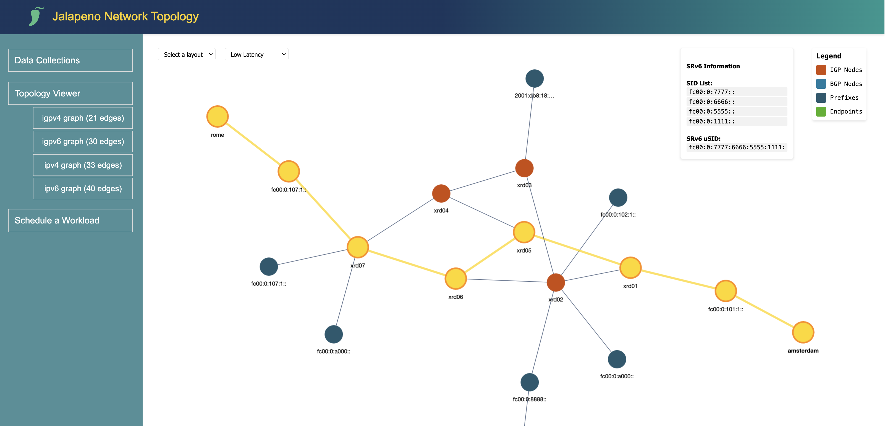

# Lab 5: Project Jalapeno and Host-Based SRv6 [20 Min]

### Description
In Lab 5 we will explore the power of SRv6 as a truly end-to-end technology through host-based SRv6, and with the help of the open-source Jalapeno platform. Jalapeno is designed to run on Kubernetes (K8s), which allows for easy integration into existing environments and supports deployment on bare metal, VMs, or in a public cloud. Kubernetes experience is not required for this lab as K8s has been preinstalled on the Jalapeno VM and we have included the required *kubectl* validation commands. We've also included a brief guide to installing Kubernetes on your own host or VM: [K8s Install Instructions](lab_4/k8s-install-instructions.md).

This lab is divided into two main sections :
* **Part 1:** Exploring the Jalapeno platform and a *`databases and APIs`* approach to SDN topology modeling
* **Part 2:** Giving applications or workloads the ability to control their own SRv6 paths through the use of *`host-based SRv6`*


## Contents
- [Lab 5: Project Jalapeno and Host-Based SRv6 \[20 Min\]](#lab-5-project-jalapeno-and-host-based-srv6-20-min)
    - [Description](#description)
  - [Contents](#contents)
  - [Lab Objectives](#lab-objectives)
    - [Validate BGP Monitoring Protocol (BMP)](#validate-bgp-monitoring-protocol-bmp)
  - [Jalapeno Overview](#jalapeno-overview)
  - [Validate Jalapeno State](#validate-jalapeno-state)
    - [Arango Graph Database](#arango-graph-database)
    - [Install Jalapeno Graph Processors](#install-jalapeno-graph-processors)
    - [Kafka](#kafka)
  - [Populating Jalapeno DB with meta-data](#populating-jalapeno-db-with-meta-data)
  - [Jalapeno REST API](#jalapeno-rest-api)
  - [Jalapeno Web UI](#jalapeno-web-ui)
    - [Data Collections](#data-collections)
    - [Topology Viewer](#topology-viewer)
  - [End of lab 5 Part 1](#end-of-lab-5-part-1)

## Lab Objectives
The student upon completion of Lab 5 should have achieved the following objectives:

* Understanding and configuration of BMP
* A tour of the Jalapeno platform and high level understanding of how it collects and processes data
* Familiarity with the ArangoDB UI and the BMP/BGP data collections the system has created
* Familiarity with the Jalapeno API and UI

### Validate BGP Monitoring Protocol (BMP)

Most transport SDN systems use BGP-LS to gather and model the underlying IGP topology. Jalapeno is intended to be a more generalized data platform to support development of all sorts of use cases such as VPNs or service chains. Because of this, Jalapeno's primary method of capturing topology data is via BMP. BMP provides all BGP AFI/SAFI info including BGP-LS, thus Jalapeno is able to model many different kinds of topologies, including the topology of the Internet (at least from the perspective of our peering routers).

We've preconfigured BMP on the **xrd05** and **xrd06** route-reflectors to send BMP data to Jalapeno's GoBMP collector. We've also enabled BMP monitoring of the RRs' BGP peering sessions with our PE routers **xrd01** and **xrd07**. With these configurations in place the RRs' will stream all BGP NLRI info they receive from the PE routers to Jalapeno to be stored in the graph database. 

Reference: the GoBMP Git Repository can be found [HERE](https://github.com/sbezverk/gobmp)

Here is an example of the BMP configuration on **xrd05** and **xrd06**:

1. Review refrence BMP configuration:
   ```
   bmp server 1
     host 198.18.128.101 port 30511
     description jalapeno GoBMP
     update-source MgmtEth0/RP0/CPU0/0
     flapping-delay 60
     initial-delay 5
     stats-reporting-period 60
     initial-refresh delay 25 spread 2

   router bgp 65000
     neighbor 10.0.0.1
       bmp-activate server 1

     neighbor fc00:0000:1111::1
       bmp-activate server 1

     neighbor 10.0.0.7
       bmp-activate server 1

     neighbor fc00:0000:7777::1
       bmp-activate server 1

     neighbor fc00:0000:8888::1
       bmp-activate server 1
   ```
2. Lets validate the BMP session on **xrd05** and **xrd06** are established and client monitoring:

      ```
      ssh cisco@clab-cleu25-xrd06
      ```

      ```
      show bgp bmp summary
      ```

      Expected output:
      ```
      RP/0/RP0/CPU0:xrd06#show bgp bmp sum
      Sat Dec 16 03:19:26.045 UTC
      ID   Host                 Port     State   Time        NBRs
      1   198.18.128.101       30511    ESTAB   00:00:07    4
      RP/0/RP0/CPU0:xrd06#
      ```

## Jalapeno Overview
Project Jalapeno combines existing open source tools with some new stuff we've developed into a data collection and warehousing infrastructure intended to enable development of network service applications. Think of it as applying microservices architecture and concepts to SDN: give developers the ability to quickly and easily build microservice control planes on top of a common data infrastructure. More information on Jalapeno can be found at the Jalapeno Git repository: 

[Jalapeno on Cisco-Open Github](https://github.com/cisco-open/jalapeno/blob/main/README.md)

**Jalapeno Architecture and Data Flow**


One of the primary goals of the Jalapeno project is to be flexible and extensible. In the future we expect Jalapeno could support any number of Topology models (LLDP, Service Chain, Service Mesh, etc.). Netflow data could be incorporated via a future integration with a tool like [pmacct](http://www.pmacct.net/). Or an operator might already have a telemetry stack and could choose to selectively integrate Jalapeno's Topology modules into an existing environment running Kafka. We also envision future integrations with other API-driven data warehouses such as Cisco ThousandEyes: https://www.thousandeyes.com/ or Accedian Skylight: https://docs.accedian.io/docs/provider-connectivity-assurance

## Validate Jalapeno State 

The Jalapeno package is preinstalled and running on the **Jalapeno** VM (198.18.128.101).

1. SSH to the Jalapeno VM and verify k8s pods are running. For those students new to Kubernetes you can reference this cheat sheet [HERE](https://kubernetes.io/docs/reference/kubectl/cheatsheet/)  

    ```
    ssh cisco@198.18.128.101
    ```
    
    Verify k8s pods
    ```
    kubectl get pods -A
    ```
    The output should look something like the following. Note that the Jalapeno VM is also using Cilium as its CNI, and that all of the Jalapeno pods/microservices are running in the **jalapeno** namespace.  Also, the Jalapeno K8s cluster is completely independent of the K8s cluster on the Berlin VM. In our simulation the Berlin VM is a consumer of services on our SRv6 network, which may include services that are accessed by interacting with Jalapeno.

    ```yaml
    cisco@jalapeno:~/jalapeno/install$ kubectl get pods -A
    NAMESPACE     NAME                                           READY   STATUS    RESTARTS         AGE
    jalapeno      arangodb-0                                     1/1     Running   0                86s
    jalapeno      gobmp-5db68bd644-dgg7w                         1/1     Running   1 (44s ago)      78s
    jalapeno      grafana-deployment-565756bd74-d26pj            1/1     Running   0                86s
    jalapeno      influxdb-0                                     1/1     Running   0                86s
    jalapeno      jalapeno-api-5d8469557-gpz8j                   1/1     Running   0                85s
    jalapeno      jalapeno-ui-54f8f95c5d-pn79v                   1/1     Running   0                84s
    jalapeno      kafka-0                                        1/1     Running   0                87s
    jalapeno      lslinknode-edge-b954577f9-w46gf                1/1     Running   3 (53s ago)      72s
    jalapeno      telegraf-egress-deployment-5795ffdd9c-7xjj4    1/1     Running   0                73s
    jalapeno      telegraf-ingress-deployment-5b456574dc-vlnvq   1/1     Running   0                79s
    jalapeno      topology-678ddb8bb4-klzmt                      1/1     Running   1 (41s ago)      73s
    jalapeno      zookeeper-0                                    1/1     Running   0                87s
    kube-system   cilium-k8fht                                   1/1     Running   3 (4h41m ago)    363d
    kube-system   cilium-operator-6f5db4f885-nmpwb               1/1     Running   3 (4h41m ago)    363d
    kube-system   coredns-565d847f94-nmt4n                       1/1     Running   0                4h40m
    kube-system   coredns-565d847f94-sg8fl                       1/1     Running   3 (4h41m ago)    363d
    kube-system   etcd-jalapeno                                  1/1     Running   19 (4h41m ago)   363d
    kube-system   kube-apiserver-jalapeno                        1/1     Running   3 (4h41m ago)    363d
    kube-system   kube-controller-manager-jalapeno               1/1     Running   3 (4h41m ago)    363d
    kube-system   kube-proxy-g8nbn                               1/1     Running   3 (4h41m ago)    363d
    kube-system   kube-scheduler-jalapeno                        1/1     Running   3 (4h41m ago)    363d
    ```

2. Optional: Display only the pods in the jalapeno namespace:
    ```
    kubectl get pods -n jalapeno
    ```

3. Optional: here are some additional k8s commands to try. Note the different outputs when specifying a particular namespace (-n option) vs. all namespaces (-A option):
    ```yaml
    kubectl get pods -n jalapeno                      # display all pods/containers in the Jalapeno namespace
    kubectl get pods -n jalapeno-collectors           # display all pods/containers in the Jalapeno-Collectors namespace
    kubectl get services -A                           # display all externally reachable services (BMP, Arango, etc.)
    kubectl get all -A                                # display a summary of all cluster info
    kubectl get nodes                                 # display cluster node info
    kubectl describe pod -n <namespace> <pod name>    # display detailed info about a pod

    example: kubectl describe pod -n jalapeno topology-678ddb8bb4-rt9jg
    ```
### Arango Graph Database
At the heart of Jalapeno is the Arango Graph Database, which is used to model network topology and provide a graph-based data store for the network data collected via BMP or other sources. 

4. Validate Jalapeno has populated the Arango graphDB with BMP data. Open the Arango web UI at:

    ```
    http://198.18.128.101:30852/
    ```
    
    Login and select the "jalapeno" DB from the dropdown:
    ```
    user: root
    password: jalapeno
    DB: jalapeno
    ```
    Once logged the UI should then show you its *collections* view, which should look something like:
   

5. Feel free to spot check the various data collections in Arango such as the *l3vpn_v4_prefix*. At this point some will be empty as we are not using those AFI/SAFI types.

**ArangoDB Query Language (AQL)**

The ArangoDB Query Language (AQL) can be used to retrieve and modify data that are stored in ArangoDB. For more information on AQL see the ArangoDB documentation [HERE](https://www.arangodb.com/docs/stable/aql/index.html)

6. Optional or for reference: feel free to connect to the DB and try some of the queries in the [lab_5-queries.md doc](https://github.com/jalapeno/SRv6_dCloud_Lab/tree/main/lab_5/lab_5-queries.md)

### Install Jalapeno Graph Processors
Jalapeno's base installation processes BMP data and populates it into ArangoDB. We have since written some addtitional processors which mine the existing data collections and create enriched topology models or graphs. We'll add these additional processors to our Jalapeno K8s cluster via a simple shell script.
   
7. ssh to Jalapeno VM, cd to the lab_5/graph-processors directory, and run the deploy.sh script:
    ```
    ssh cisco@198.18.128.101
    ```
    ```
    cd ~/SRv6_dCloud_Lab/lab_5/graph-processors
    ./deploy.sh
    ```

> [!NOTE]
> The script will also re-deploy the Jalapeno UI and API so they get the latest changes. You may get a couple warning messages about the UI and API already being deployed, but they can be ignored.

The new processors will have created the following new collections in the Arango graphDB, feel free to explore them in the ArangoDB UI, or move on to the next section.

   - *`igpv4_graph`*: a model of the ipv4 IGP topology including SRv6 SID data
   - *`igpv6_graph`*: a model of the ipv6 IGP topology including SRv6 SID data
   - *`ipv4_graph`*: a model of the entire ipv4 topology (IGP and BGP)
   - *`ipv6_graph`*: a model of the entire ipv6 topology (IGP and BGP)
   - *`sr_local_sids`*: a collection of SRv6 SID information that is not available via BMP

  
8. Verify the Graph Processors have deployed successfully:
    ```
    kubectl get pods -n jalapeno
    ```

    Expected (truncated) output::
    ```
    igp-graph-5f7fcd6f88-8xqxr                     1/1     Running   0              53s
    ipv4-graph-7ccc46bc57-xzjnk                    1/1     Running   0              53s
    ipv6-graph-56db757fc9-kgbbg                    1/1     Running   0              52s
    srv6-localsids-78c644bc76-ccpwh                1/1     Running   0              52s
    ```
### Kafka 

Jalapeno uses the very popular Kafka messaging bus to transport data received from the network to data processors which map it into the graph database. We've included a brief guide to exploring the Jalapeno Kafka setup. This element of the lab is completely optional, however, because this lab guide is published on Github, you can come back to it in the future to explore Kafka on your own.

[Explore Kafka on Jalapeno](lab_5/lab_5-kafka.md)

## Populating Jalapeno DB with meta-data

In preparation for our Host-Based SRv6 use cases in Part 2, we need to populate the DB with meta-data that we will use for upcoming path calculation API calls.

The [add_meta_data.py](python/add_meta_data.py) python script will connect to the ArangoDB and populate elements in our data collections with addresses and country codes. Also, due to the fact that we can't run realistic traffic through the XRd topology the script will populate the relevant graphDB elements with synthetic *link latency* and *outbound link utilization* data per this diagram:


1. Return to the ssh session on the Jalapeno VM and add meta data to the DB. 
   ```
   cd ~/SRv6_dCloud_Lab/lab_5/python/
   python3 add_meta_data.py
   ```
   Expected output:
   ```
   cisco@jalapeno:~/SRv6_dCloud_Lab/lab_5/python$ python3 add_meta_data.py
   adding hosts, addresses, country codes, and synthetic latency data to the graph
   adding location, country codes, latency, and link utilization data
   meta data added
   Successfully inserted/updated 3 hosts records
   Successfully inserted/updated 4 IPv4 edge records
   Successfully inserted/updated 6 IPv6 edge records
   ```
  
> [!NOTE]
> The *`add_meta_data.py`* script has also populated country codes for all the countries a given link traverses from one node to its adjacent peer. Example: **xrd01** is in Amsterdam, and **xrd02** is in Berlin. Thus the **xrd01** <--> **xrd02** link traverses *`[NLD, DEU]`*


## Jalapeno REST API
The Jalapeno REST API is used to run queries against the ArangoDB and retrieve graph topology data or execute shortest path calculations. 

1. Test the Jalapeno REST API:
   From the ssh session on the Jalapeno VM or the XRD VM (or the command line on your local machine) validate the Jalapeno REST API is running. We installed the *`jq`* tool to help with improved JSON parsing:
   ```
   curl http://198.18.128.101:30800/api/v1/collections | jq | more
   ```

   The API also has auto-generated documentation at: [http://198.18.128.101:30800/docs/](http://198.18.128.101:30800/docs/) 

2. The Jalapeno API github repo has a collection of example curl commands as well:

    [Jalapeno API Github](https://github.com/jalapeno/jalapeno-api/blob/main/notes/curl-commands.md)

## Jalapeno Web UI

The Jalapeno UI is a demo or proof-of-concept meant to illustrate the potential use cases for extending SRv6 services beyond traditional network elements and into the server, host, VM, k8s, or other workloads. Once Jalapeno has programmatically collected data from the network and built its topology graphs, the network operator has complete flexibility to add data or augment the graph as we saw in the previous section. From there, its not too difficult to conceive of building network services based on calls to the Jalapeno API and leveraging the SRv6 uSID stacks that are returned.

Each lab instance has a Jalapeno Web UI that can be accessed at the following URL: [http://198.18.128.101:30700](http://198.18.128.101:30700). 

On the left hand sidebar you will see that UI functionality is split into three sections:

- **Data Collections**: explore raw object and graph data collected from the network.
- **Topology Viewer**: explore the network topology graphs and perform path calculations.
- **Schedule a Workload**: this function is under construction. 

### Data Collections
Currently populated with raw BMP and graph data. We have placeholders for future data collections such as Services (like firewalls or load balancers), Hosts, and GPUs.


### Topology Viewer
The Topology Viewer prompts the user to select a graph from the dropdown and then displays the graph in the center of the screen. The graph is interactive and the user can hover over a node to see more information about it. There are dropdowns to change the graph's layout and to perform path calculations based on a selected constraint. 



To perform a path calculation select a source and destination node in the graph, then select a constraint from the dropdown. The application will then calculate and light up the shortest path through the network based on the selected constraint. Finally the user can click on nodes along a path and the relevant SRv6 SID list will be displayed in the upper right corner of the screen.
The path calculation algorithms on the backend are using the telemetry meta data we uploaded earlier in the lab. In a future release we hope to incorporate gRPC based streaming telemetry data into the graph and include it in path calculations.

**Constraints:**
* **Lowest Latency**: The path calculation will return the shortest path through the network based on the latency meta-data we uploaded earlier in the lab
* **Least Utilized**: The path calculation will return the path with the lowest average outbound utilization
* **Data Sovereignty**: The user can select a country to avoid and the path calculation will return the path that traverses the network avoiding the selected country.


## End of lab 5 Part 1
Please proceed to [Lab 5 Part 2: Host-Based SRv6](lab_5-guide_part-2.md)
