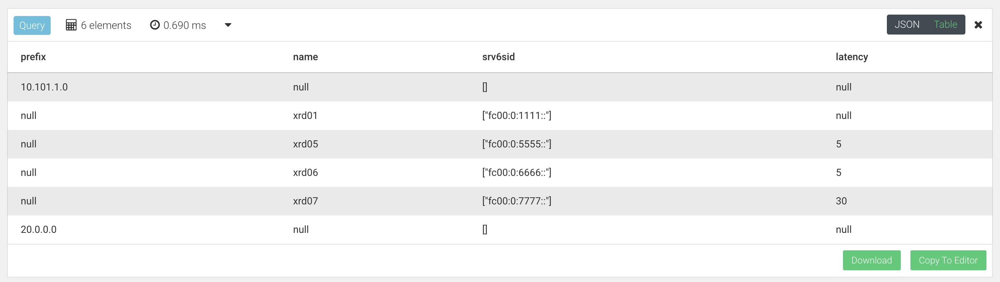
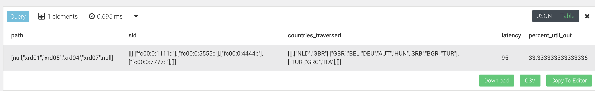

## Lab 5 Part 2: Host-Based SRv6

### Use Case 1: Lowest Latency Path
Our first use case is to make path selection through the network based on the cummulative link latency from A to Z. Using latency meta-data is not something traditional routing protocols can do. It may be possible to statically build routes through your network using weights to define a path. However, what these work arounds cannot do is provide path selection based on near real time data which is possible with an application like Jalapeno. This provides customers to have a flexible network policy that can react to changes in the WAN environment.

> [!TIP]
> General Arango AQL graph query syntax information can be found [HERE](https://www.arangodb.com/docs/stable/aql/graphs.html). Please reference this document on the shortest path algorithim in AQL [HERE](https://www.arangodb.com/docs/stable/aql/graphs-shortest-path.html) (2 minute read).

In this use case we want to idenitfy the lowest latency path for traffic originating from the *`10.101.1.0/24`* (Amsterdam) destined to *`20.0.0.0/24`* (Rome). We will utilize Arango's shortest path query capabilities and specify latency as our weighted attribute pulled from the meta-data. See image below which shows the shortest latency path we expect to be returned by our query.
> [!NOTE]
> The *10.101.1.0/24* and *20.0.0.0/24* prefixes are in the global routing table, which is reflected in the query.


   1. Return to the ArangoDB browser UI and run a shortest path query from *10.101.1.0/24* to *20.0.0.0/24* , and have it return SRv6 SID data.
      ```
      for v, e in outbound shortest_path 'unicast_prefix_v4/10.101.1.0_24_10.0.0.1' 
          TO 'unicast_prefix_v4/20.0.0.0_24_10.0.0.7' ipv4_graph OPTIONS {weightAttribute: 'latency' } 
          return  { prefix: v.prefix, name: v.name, srv6sid: v.sids[*].srv6_sid, latency: e.latency }
      ```
   
   2. Examine the table output and it should match the expected path in the diagram above. See sample output below.
   

#### SRv6-TE for XR Global Routing Table
Now we will modify the configuration for **xrd07** to incorporate SRv6-TE policy for route 20.0.0.0/24. Lets log in and get configuring!

1. On router **xrd07** add in config to advertise the global prefix with the low latency community.
   ```
   conf t
   extcommunity-set opaque low-latency
     50
   end-set

   route-policy set-global-color
      if destination in (20.0.0.0/24) then
        set extcommunity color low-latency
      endif
      pass
   end-policy 
   commit
   ```
2. Add in BGP configuration to link the set-global-color policy to the ipv4 peering group
   ```
    router bgp 65000
     neighbor-group xrd-ipv4-peer
      address-family ipv4 unicast
       route-policy set-global-color out 
    commit
   ```
3. If we wanted to implement the returned query data into SRv6-TE steering config on router **xrd01** we would create a policy like the below example. 
   
> [!NOTE]
> We already created the segment-list and policy back in Lab 3, so now the policy will be re-used for steering global table traffic to *20.0.0.0/24*.
   
      For review, the below SRv6 segment-list would define the hops returned from our query between router **xrd01** (source) and **xrd07** (destination). The segment-list doesn't need to include *`fc00:0:7777::`* as **xrd07's** SRv6 uSID is automatically added as it represents the SRv6 policy endpoint.
      ```
      segment-routing
        traffic-eng
          segment-lists
            segment-list xrd567
              srv6
                index 10 sid fc00:0:5555::
                index 20 sid fc00:0:6666::
      ```
      Here is the accompanying SRv6-TE policy that connects the *extcommunity/color 50* to our segment list *xrd567*
      ```
      policy low-latency
        srv6
          locator MyLocator binding-sid dynamic behavior ub6-insert-reduced
   
        color 50 end-point ipv6 fc00:0:7777::1
        candidate-paths
          preference 100
            explicit segment-list xrd567
      ```

### Use Case 2: Lowest Bandwidth Utilization Path
In this use case we want to idenitfy the lowest utilized path for traffic originating from the *10.101.1.0/24* (Amsterdam) prefix destined to *20.0.0.0/24* (Rome). We will utilize Arango's shortest path query capabilities and specify link utilization as our *weighted attribute* pulled from the meta-data. See image below which shows the shortest latency path we expect to be returned by our query.

> [!NOTE]
> This query is being performed in the global routing table.


   1. Return to the ArangoDB browser UI and run a shortest path query from 10.101.1.0/24 to 20.0.0.0/24, and have it return SRv6 SID data.
      ```
      for v, e in outbound shortest_path 'unicast_prefix_v4/10.101.1.0_24_10.0.0.1' 
          TO 'unicast_prefix_v4/20.0.0.0_24_10.0.0.7' ipv4_graph options { weightAttribute: 'percent_util_out' } filter e.mt_id != 2
      return { node: v._key, name: v.name, sid: v.sids[*].srv6_sid, util: e.percent_util_out }
      ```
   
   2. Examine the table output and it should match the expected path in the diagram above. See sample output below.
   

  3. If we wanted to implement the returned query data into SRv6-TE steering XR config on router **xrd01** we would create a policy like the below example.
     
  4. Optional: on router **xrd07** add in config to advertise the global prefix with the bulk transfer community.
     ```
     extcommunity-set opaque bulk-transfer
       40
     end-set

     route-policy set-global-color
        if destination in (20.0.0.0/24) then
          set extcommunity color bulk-transfer
        endif
        pass
     end-policy 
     ```
  5. On router **xrd01** we would add an SRv6 segment-list config to define the hops returned from our query between router **xrd01** (source) and **xrd07** (destination). 
   
      ```
      segment-routing
        traffic-eng
          segment-lists
            segment-list xrd567
              srv6
               index 10 sid fc00:0:2222::
               index 20 sid fc00:0:3333::
               index 30 sid fc00:0:4444:: 

          policy bulk-transfer
           srv6
            locator MyLocator binding-sid dynamic behavior ub6-insert-reduced
           !
           color 40 end-point ipv6 fc00:0:7777::1
           candidate-paths
            preference 100
             explicit segment-list xrd2347
      ```
> [!NOTE]
> This configuration was applied in Lab 3 and is shown here for informational purposes only.
  
### Use Case 3: Data Sovereignty Path
In this use case we want to idenitfy a path originating from the *10.101.1.0/24* (Amsterdam) destined to *20.0.0.0/24* (Rome) that avoids passing through France (perhaps there's a toll on the link). We will utilize Arango's shortest path query capability and filter out results that pass through **xrd06** based in Paris, France. See image below which shows the shortest latency path we expect to be returned by our query.

> [!NOTE]
> This query is being performed in the global routing table.


   1. Return to the ArangoDB browser UI and run a shortest path query from *10.101.1.0/24* to *20.0.0.0/24* , and have it return SRv6 SID data.
      ```
      for p in outbound k_shortest_paths  'unicast_prefix_v4/10.101.1.0_24_10.0.0.1' 
          TO 'unicast_prefix_v4/20.0.0.0_24_10.0.0.7' ipv4_graph 
            options {uniqueVertices: "path", bfs: true} 
            filter p.edges[*].country_codes !like "FRA" limit 1 
                return { path: p.vertices[*].name, sid: p.vertices[*].sids[*].srv6_sid, 
                    countries_traversed: p.edges[*].country_codes[*], latency: sum(p.edges[*].latency), 
                        percent_util_out: avg(p.edges[*].percent_util_out)} 
      ```
   
   2. Examine the table output and it should match the expected path in the diagram above. See sample output below.
   
   
   3. As in previous examples you could create an SRv6-TE segment-list and policy reflecting the SID list returned by the Arango query. 
     

### End of lab 5
Please proceed to [Lab 6](https://github.com/jalapeno/SRv6_dCloud_Lab/tree/main/lab_6/lab_6-guide.md)
