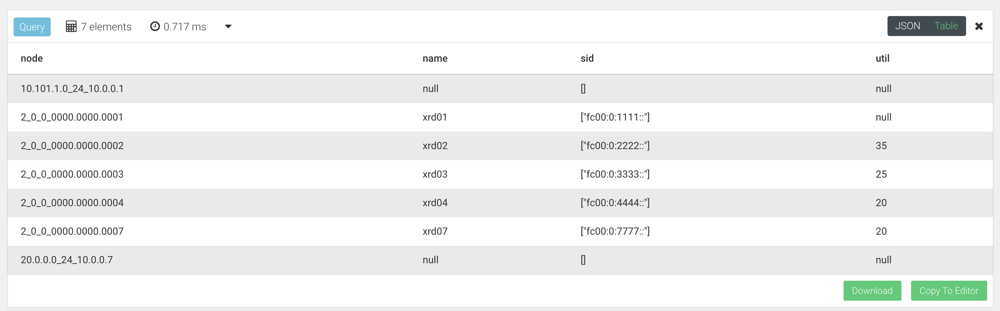

# Lab 5 Part 2: Host-Based SRv6

In Part 2 we will explore the experimental Jalapeno-UI and linux SRv6 client. The UI is very much a work in progress and is meant to illustrate the potential use cases for extending SRv6 services beyond traditional network elements and into the server, host, VM, k8s, or other workloads or endpoints. Once Jalapeno has programmatically collected data from the network and it built its topology graphs, the network operator has complete flexibility to add data or augment the graph as we saw toward the end of Part 1. From there its not too difficult to conceive of building network services based on calls to the Jalapeno API and leveraging the SRv6 uSID stacks that are returned.

## Contents
- [Lab 5 Part 2: Host-Based SRv6](#lab-5-part-2-host-based-srv6)
  - [Contents](#contents)
  - [Jalapeno Web UI](#jalapeno-web-ui)
    - [Data Collections](#data-collections)
    - [Topology Viewer](#topology-viewer)
    - [Calculate a Path](#calculate-a-path)
  - [Use Case 1: Lowest Latency Path](#use-case-1-lowest-latency-path)
    - [Use Case 2: Lowest Bandwidth Utilization Path](#use-case-2-lowest-bandwidth-utilization-path)
    - [Use Case 3: Data Sovereignty Path](#use-case-3-data-sovereignty-path)
    - [End of lab 5](#end-of-lab-5)

## Jalapeno Web UI
Each lab instance has a Jalapeno Web UI that can be accessed at the following URL: `http://198.18.128.101:30700`. On the left hand sidebar you will see that functionality is split into four sections:

- **Data Collections**: explore raw object and graph data collected from the network.
- **Topology Viewer**: explore the network topology graphs built by Jalapeno and based on BMP data received from the network.
- **Calculate a Path**: gives the user the ability to select a source and destination in the graph and calculate the best path through the network based upon a selected constraint. The calculated path will light up and the application will display the relevant SRv6 uSID stack.
- **Schedule a Workload**: this function is still under construction. The idea behind `Schedule a Workload` is have a fabric load-balancing service where the user can select a set of endpoints, such as hosts or even GPUs, then ask Jalapeno to calculate a set of paths based on each source/destination pair of the selected endpoints. Jalapeno would return a set of uSIDs that would evenly balance the source/destination flows across available paths in the fabric.

### Data Collections
Currently populated with raw BMP data and graph data. We have placeholder's for future data collections such as Services (like firewalls or load balancers), Hosts, and GPUs.


### Topology Viewer
Prompts the user to select a graph from the dropdown and then displays the graph in the center of the screen. The graph is interactive and the user can hover over a node to see more information about it. There are also dropdowns to change the graph's layout and to show a 'nodes-only' view. Funally the user can click on nodes along a path and the relevant SRv6 uSID stack will be displayed in the upper right corner of the screen.


### Calculate a Path


## Use Case 1: Lowest Latency Path
Our first use case is to make path selection through the network based on the cummulative link latency from A to Z. Using latency meta-data is not something traditional routing protocols can do. It may be possible to statically build routes through your network using weights to define a path. However, what these workarounds cannot do is provide path selection based on near real time data which is possible with an application like Jalapeno. This provides customers to have a flexible network policy that can react to changes in the WAN environment.

> [!TIP]
> General Arango AQL graph query syntax information can be found [HERE](https://www.arangodb.com/docs/stable/aql/graphs.html). Please reference this document on the shortest path algorithim in AQL [HERE](https://www.arangodb.com/docs/stable/aql/graphs-shortest-path.html) (2 minute read).

In this use case we want to idenitfy the lowest latency path for traffic originating from the *`10.101.1.0/24`* (Amsterdam) destined to *`20.0.0.0/24`* (Rome). We will utilize Arango's shortest path query capabilities and specify latency as our weighted attribute pulled from the meta-data. See image below which shows the shortest latency path we expect to be returned by our query.
> [!NOTE]
> The *10.101.1.0/24* and *20.0.0.0/24* prefixes are in the global routing table, which is reflected in the query.


   1. Return to the ArangoDB browser UI and run a shortest path query from *10.101.1.0/24* to *20.0.0.0/24* , and have it return SRv6 SID data.
      ```
      for v, e in outbound shortest_path 'ibgp_prefix_v4/10.101.1.0_24' TO 'ibgp_prefix_v4/20.0.0.0_24' ipv4_graph OPTIONS {weightAttribute: 'latency' } return  { prefix: v.prefix, name: v.name, srv6sid: v.sids[*].srv6_sid, latency: e.latency }
      ```
   
   2. Examine the table output and it should match the expected path in the diagram above. See sample output below.
   


### Use Case 2: Lowest Bandwidth Utilization Path
In this use case we want to identify the least utilized path for traffic originating from the *10.101.1.0/24* (Amsterdam) prefix destined to *20.0.0.0/24* (Rome). We will utilize Arango's shortest path query capabilities and specify link utilization as our *weighted attribute* pulled from the meta-data. 

   1. Return to the ArangoDB browser UI and run a shortest path query from 10.101.1.0/24 to 20.0.0.0/24, and have it return SRv6 SID data.
      ```
      for v, e in outbound shortest_path 'ibgp_prefix_v4/10.101.1.0_24' 
          TO 'ibgp_prefix_v4/20.0.0.0_24' ipv4_graph options { weightAttribute: 'percent_util_out' } filter e.mt_id != 2
      return { node: v._key, name: v.name, sid: v.sids[*].srv6_sid, util: e.percent_util_out }
      ```
   
   2. Examine the table output and it should match the expected path in the diagram above. See sample output below.
   

  1. If we wanted to implement the returned query data into SRv6-TE steering XR config on router **xrd01** we would create a policy like the below example.
     
  2. Optional: on router **xrd07** add in config to advertise the global prefix with the bulk transfer community.
     ```
     extcommunity-set opaque bulk-transfer
       40
     end-set

     route-policy set-global-color
        if destination in (20.0.0.0/24) then
          set extcommunity color bulk-transfer
        endif
        pass
     end-policy 
     ```
  3. On router **xrd01** we would add an SRv6 segment-list config to define the hops returned from our query between router **xrd01** (source) and **xrd07** (destination). 
   
      ```
      segment-routing
        traffic-eng
          segment-lists
            segment-list xrd567
              srv6
               index 10 sid fc00:0:2222::
               index 20 sid fc00:0:3333::
               index 30 sid fc00:0:4444:: 

          policy bulk-transfer
           srv6
            locator MyLocator binding-sid dynamic behavior ub6-insert-reduced
           !
           color 40 end-point ipv6 fc00:0:7777::1
           candidate-paths
            preference 100
             explicit segment-list xrd2347
      ```
> [!NOTE]
> This configuration was applied in Lab 3 and is shown here for informational purposes only.
  
### Use Case 3: Data Sovereignty Path
In this use case we want to idenitfy a path originating from the *10.101.1.0/24* (Amsterdam) destined to *20.0.0.0/24* (Rome) that avoids passing through France (perhaps there's a toll on the link). We will utilize Arango's shortest path query capability and filter out results that pass through **xrd06** based in Paris, France. See image below which shows the shortest latency path we expect to be returned by our query.

> [!NOTE]
> This query is being performed in the global routing table.


   1. Return to the ArangoDB browser UI and run a shortest path query from *10.101.1.0/24* to *20.0.0.0/24* , and have it return SRv6 SID data.
      ```
      for p in outbound k_shortest_paths  'ibgp_prefix_v4/10.101.1.0_24' 
          TO 'ibgp_prefix_v4/20.0.0.0_24' ipv4_graph 
            options {uniqueVertices: "path", bfs: true} 
            filter p.edges[*].country_codes !like "FRA" limit 1 
                return { path: p.vertices[*].name, sid: p.vertices[*].sids[*].srv6_sid, 
                    countries_traversed: p.edges[*].country_codes[*], latency: sum(p.edges[*].latency), 
                        percent_util_out: avg(p.edges[*].percent_util_out)} 
      ```
   
   2. Examine the table output and it should match the expected path in the diagram above. See sample output below.
   
   
   3. As in previous examples you could create an SRv6-TE segment-list and policy reflecting the SID list returned by the Arango query. 
     

### End of lab 5
Please proceed to [Lab 6](https://github.com/jalapeno/SRv6_dCloud_Lab/tree/main/lab_6/lab_6-guide.md)
