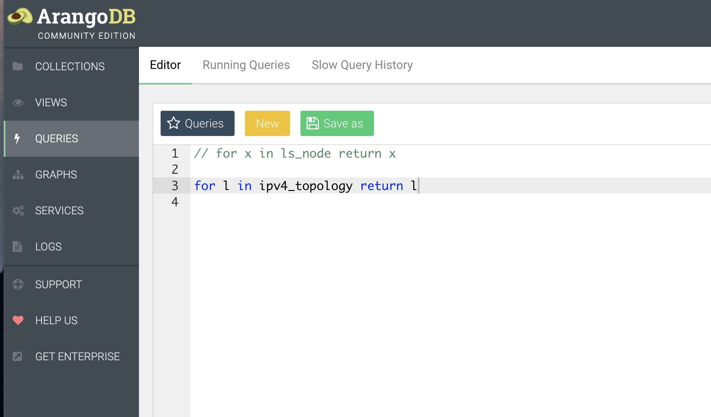

#### Sample Basic Queries

> [!Note]
> General Arango AQL graph query syntax information can be found [HERE](https://www.arangodb.com/docs/stable/aql/graphs.html). Please reference this document on the shortest path algorithim in AQL [HERE](https://www.arangodb.com/docs/stable/aql/graphs-shortest-path.html) (2 minute read).

On the left side of the Arango UI click on Queries:
    
For the most basic query below *x* is a object variable with each key field in a record populated as a child object. So basic syntax can be thought of as:

*`for x in <collection_name> return x `*

```
for x in ls_node return x
```
This query will return ALL records in the *`ls_node`* collection. In our lab topology you should expect 7 records. 


Next lets get the AQL to return only the *`key:value`* field we are interested in. We will query the name of all nodes in the *`igp_node`* collection with the below query. To reference a specific key field we use use the format **x.key** syntax.

    - Note: after running a query you will need to either comment it out or delete it before running the next query. To comment-out use two forward slashes *`//`* as shown in this pic:





```
for x in igp_node return x.name
```
Expected output from Arango query:
```   
"xrd01",
"xrd02",
"xrd03",
"xrd04",
"xrd05",
"xrd06",
"xrd07"
```

Query filtering for a specific node name and return name and SID information 
```
for x in igp_node 
    filter x.name == "xrd04"
return {Name: x.name, SID: x.sids}
```

Truncated output:
```
{
    "Name": "xrd04",
    "SID": [
    {
        "srv6_sid": "fc00:0:4444::",
        "srv6_endpoint_behavior": {
        "endpoint_behavior": 48,
        "flag": 0,
        "algo": 0
        },
        "srv6_sid_structure": {
        "locator_block_length": 32,
        "locator_node_length": 16,
        "function_length": 0,
        "argument_length": 80
        }
    }
    ]
}
```

Filter on multiple conditions we can through a boolean value in to return the **xrd01** and **xrd07** records.
```
for x in igp_node 
    filter x.name == "xrd01" or x.name=="xrd07"
return {Name: x.name, SID: x.sids}
```

Query all IGP links in the DB:
```
for x in ls_link return x
```
Query for all IPv4 IGP links:
```
for x in ls_link filter x.mt_id_tlv.mt_id !=2 return x
```
Query for all IPv4 IGP links and return specific k:v pairs:
```
for x in ls_link filter x.mt_id_tlv.mt_id !=2 return { key: x._key, router_id: x.router_id, 
    igp_id: x.igp_router_id, local_ip: x.local_link_ip, remote_ip: x.remote_link_ip }
```
Query for the base IGP topology (Nodes and Links):
```
for x in ls_node_edge return x
```

Query for the full IGP topology including IGP prefixes (should match the xrd router topology):
```
for x in igpv4_graph return x
```
```
for x in igpv6_graph return x
```
Query for the entire network topology (should match the xrd topology plus some spokes out to attached BGP networks):
```
for x in ipv4_graph return x
```
```
for x in ipv6_graph return x
```
Query the igp_node dataset and return specific k:v pairs:
```
for x in igp_node return { node: x.router_id, name: x.name, srv6sid: x.sids[*].srv6_sid }
```

#### Return to lab_5 guide and run the add_meta_data.py step. 
[add_meta_data](https://github.com/jalapeno/SRv6_dCloud_Lab/blob/main/lab_5/lab_5-guide.md#populating-the-db-with-external-data)

#### Then run this next set of queries
```
for x in ipv4_graph filter x.latency != null return { key: x._key, from: x._from, to: x._to, latency: x.latency, utilization: x.percent_util_out, country_codes: x.country_codes }
```

#### replaces shortest path query #3
```
for v, e in any shortest_path 'ibgp_prefix_v4/10.101.1.0_24' TO 'ibgp_prefix_v4/20.0.0.0_24' ipv4_graph return  { key: v._key, node: v.name, location: v.location_id, address: v.address, sid: v.sids[*].srv6_sid, latency: e.latency }
```

#### replaces shortest path query #4
```
for v, e in any shortest_path 'ibgp_prefix_v4/10.101.1.0_24' TO 'ibgp_prefix_v4/20.0.0.0_24' ipv4_graph return  { key: v._key, node: v.name, location: v.location_id, address: v.address, sid: v.sids[*].srv6_sid, latency: e.latency }
```

#### replace least utilized path queries:
```
for v, e, p in 1..6 outbound 'ibgp_prefix_v4/10.101.1.0_24' ipv4_graph options {uniqueVertices: "path", bfs: true} filter v._id == 'ibgp_prefix_v4/20.0.0.0_24' return distinct { path: p.vertices[*].name, sid: p.vertices[*].sids[*].srv6_sid, country_list: p.edges[*].country_codes[*], latency: sum(p.edges[*].latency), percent_util_out: avg(p.edges[*].percent_util_out)}

```
```
for v, e, p in 1..6 outbound 'ibgp_prefix_v4/20.0.0.0_24' ipv4_graph options {uniqueVertices: "path", bfs: true} filter v._id == 'ibgp_prefix_v4/10.101.1.0_24' return { path: p.vertices[*].name, sid: p.vertices[*].sids[*].srv6_sid, country_list: p.edges[*].country_codes[*], latency: sum(p.edges[*].latency), percent_util_out: avg(p.edges[*].percent_util_out)}

```

#### Shortest path from host to host
Next we can expand the diameter of our query. In this case its no longer just ingress router to egress router, its a shortest path query from source prefix (Amsterdam VM) to destination prefix (Rome VM). This example query also includes hop by hop latency:
```
for v, e in outbound shortest_path 'hosts/amsterdam' 
    TO 'hosts/rome' ipv4_graph 
    return  { node: v.name, location: v.location_id, address: v.address, 
    srv6sid: v.sids[*].srv6_sid, latency: e.latency }
```

#### Data Sovereignty query
A query
```
for p in outbound k_shortest_paths  'hosts/amsterdam' 
          TO 'hosts/rome' ipv4_graph 
            options {uniqueVertices: "path", bfs: true} 
            filter p.edges[*].country_codes !like "FRA" limit 1 
                return { path: p.vertices[*].name, sid: p.vertices[*].sids[*].srv6_sid, 
                    countries_traversed: p.edges[*].country_codes[*], latency: sum(p.edges[*].latency), 
                        percent_util_out: avg(p.edges[*].percent_util_out)}
```

To reset load value:
```
FOR doc IN ipv4_graph
  UPDATE doc WITH { load: 0 } IN ipv4_graph

## Back to Lab 5 Guide
[Lab 5 Guide](https://github.com/jalapeno/SRv6_dCloud_Lab/tree/main/lab_5/lab_5-guide.md)