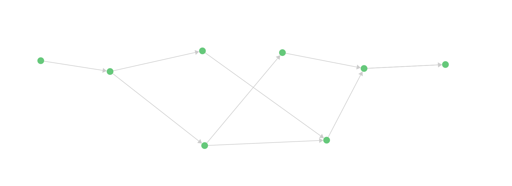
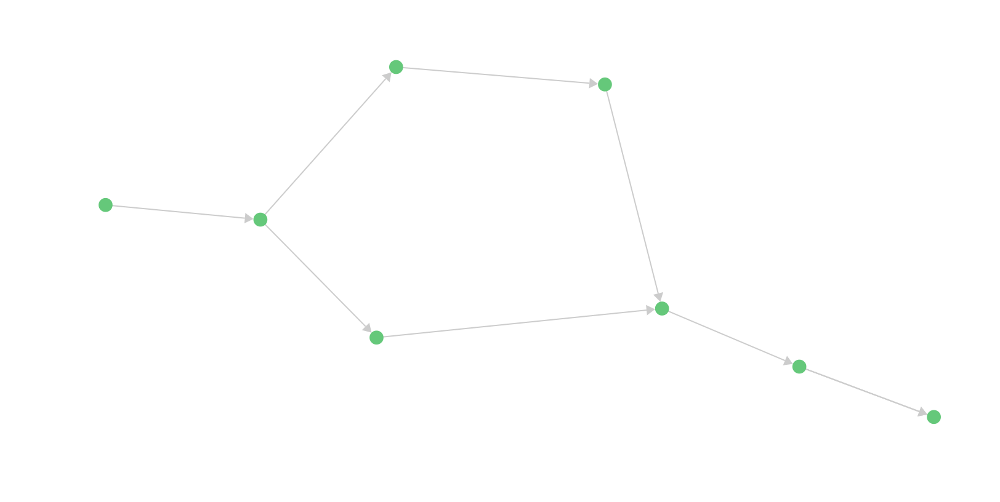

## Lab 6: Exploring Jalapeno, Kafka, and ArangoDB

### Description
In Lab 6 we will explore the Jalapeno system running on Kubernetes. We will log into the Kafka container and monitor topics for data coming in from Jalapeno's data collectors. Data which is subsequently picked up by Jalapeno's data processors (topology, lslinknode, sr-node, sr-topology, etc.) and written to the Arango graphDB. We will spend some time getting familiar with ArangoDB and the Jalapeno data collections, and will run some basic queries. Lastly we will populate the graphDB with some synthetic data and run a number of complex queries including graph traversals.

## Contents
- [Lab 6: Exploring Jalapeno, Kafka, and ArangoDB](#lab-6-exploring-jalapeno-kafka-and-arangodb)
  - [Description](#description)
- [Contents](#contents)
- [Lab Objectives](#lab-objectives)
- [Jalapeno Software Stack](#jalapeno-software-stack)
- [Kafka](#kafka)
  - [Kafka Intro](#kafka-intro)
  - [Kafka Topics](#kafka-topics)
  - [Monitoring a Kafka topic](#monitoring-a-kafka-topic)
    - [ISIS Link State](#isis-link-state)
    - [SRv6 Locator SID](#srv6-locator-sid)
  - [Arango GraphDB](#arango-graphdb)
  - [Populating the DB with external data](#populating-the-db-with-external-data)
  - [Arango Graph traversals and shortest path queries](#arango-graph-traversals-and-shortest-path-queries)
    - [Shortest Path](#shortest-path)
  - [Shortest path queries using metrics other than hop count](#shortest-path-queries-using-metrics-other-than-hop-count)
    - [Query for the lowest latency path:](#query-for-the-lowest-latency-path)
  - [Graph Traversals](#graph-traversals)
    - [Query for the least utilized path](#query-for-the-least-utilized-path)
  - [K Shortest Paths](#k-shortest-paths)
    - [A Data sovereignty query](#a-data-sovereignty-query)
  - [End of lab 6](#end-of-lab-6)

## Lab Objectives
The student upon completion of Lab 6 should have achieved the following objectives:

* A tour of the Jalapeno platform and high level understanding of how it collects and processes data
* Familiarity with Kafka and Kafka's command line utilities
* Familiarity with the ArangoDB UI and the BMP/BGP data collections the system has created
* Familiarity with Arango Query Language (AQL) syntax
* Familiarity with more complex Arango shortest-path and graph traversal queries

## Jalapeno Software Stack
 

## Kafka
### Kafka Intro
From the Kafka [homepage](https://kafka.apache.org/): Apache Kafka is an open-source distributed event streaming platform used by thousands of companies for high-performance data pipelines, streaming analytics, data integration, and mission-critical applications.

Jalapeno uses Kafka as a message bus between its data collectors and data processors. Jalapeno's data collectors create Kafka topics then publish their datasets to those topics. The data processors subscribe to the relevant Kafka topics, gather the published data, and write it to either the Arango graphDB or Influx Time-Series DB. This `Collector -> Kafka -> Processor -> DB` pipeline allows for architectural flexibility and extensibility such that other applications could subscribe to the Jalapeno Kafka topics and use the BMP or telemetry data for their own purposes.

Kafka has a number of built in command line utilities to do things like listing topics or outputting of topic data to the screen, which we'll do in the next section of the lab. 

For additional help on Kafka see this external CLI cheat sheet [HERE](https://medium.com/@TimvanBaarsen/apache-kafka-cli-commands-cheat-sheet-a6f06eac01b)


### Kafka Topics 

1. In a separate terminal session ssh to the Jalapeno VM 
    ```
    cisco@198.18.128.101
    pw = cisco123
    ```

2. Login to the Kafka container and cd into the bin directory
    ```
    kubectl exec -it kafka-0 -n jalapeno -- /bin/bash

    cd bin
    ls -la
    ```

3. The Jalapeno deployment of Kakfa includes enablement of JMX (Java Management Extensions), which allows for monitoring of Kafka elements such as brokers, topics, Zookeeper, etc. To operate the CLI utilies we'll need to unset the JMX_PORT:  
    ```
    unset JMX_PORT
    ```

4. Run the CLI utility to get a listing of all Kafka topics in our cluster:
    ```
    ./kafka-topics.sh --list  --bootstrap-server localhost:9092
    ```
    - A few seconds after running the *--list* command you should see the following list of topics toward the bottom on the command output:
    ```
    gobmp.parsed.evpn
    gobmp.parsed.evpn_events
    gobmp.parsed.flowspec
    gobmp.parsed.flowspec_events
    gobmp.parsed.flowspec_v4
    gobmp.parsed.flowspec_v4_events
    gobmp.parsed.flowspec_v6
    gobmp.parsed.flowspec_v6_events
    gobmp.parsed.l3vpn
    gobmp.parsed.l3vpn_events
    gobmp.parsed.l3vpn_v4
    gobmp.parsed.l3vpn_v4_events
    gobmp.parsed.l3vpn_v6
    gobmp.parsed.l3vpn_v6_events
    gobmp.parsed.ls_link
    gobmp.parsed.ls_link_events
    gobmp.parsed.ls_node
    gobmp.parsed.ls_node_events
    gobmp.parsed.ls_prefix
    gobmp.parsed.ls_prefix_events
    gobmp.parsed.ls_srv6_sid
    gobmp.parsed.ls_srv6_sid_events
    gobmp.parsed.peer
    gobmp.parsed.peer_events
    gobmp.parsed.sr_policy
    gobmp.parsed.sr_policy_events
    gobmp.parsed.sr_policy_v4
    gobmp.parsed.sr_policy_v4_events
    gobmp.parsed.sr_policy_v6
    gobmp.parsed.sr_policy_v6_events
    gobmp.parsed.unicast_prefix
    gobmp.parsed.unicast_prefix_events
    gobmp.parsed.unicast_prefix_v4
    gobmp.parsed.unicast_prefix_v4_events
    gobmp.parsed.unicast_prefix_v6
    gobmp.parsed.unicast_prefix_v6_events
    jalapeno.ls_node_edge_events
    jalapeno.telemetry
    ```

### Monitoring a Kafka topic

The *kafka-console-consumer.sh* utility allows one to manually monitor a given topic and see messages as they are published to Kafka by the GoBMP collector. This gives us a nice troubleshooting tool for scenarios where a router may be sending data to the collector, but the data is not seen in the DB.

In the next set of steps we'll run the CLI to monitor a Kafka topic and watch for data from GoBMP. GoBMP's topics are fairly quiet unless BGP updates are happening, so once we have our monitoring session up we'll clear BGP-LS on the RR, which should result in a flood of data onto the topic.

In this exercise we are going to stitch together several elements that we have worked on through out this lab. The routers in our lab have a number of topology-relevant configurations, including several that we've added over the course of labs 1 - 5. We will use the tools to examine how that data is communicated through the network and ultimately collected and populated into Jalapeno's DB.

#### ISIS Link State
   1. Monitor the BGP-LS *"ls_node"* topic for incoming BMP messages describing ISIS nodes in the network:

        ```
        ./kafka-console-consumer.sh --bootstrap-server localhost:9092  --topic gobmp.parsed.ls_node
        ```

        Optional - enable terminal monitoring and debugging the of BGP-LS address family on one of the route reflectors such as **xrd05**:
        ```
        terminal monitor
        debug bgp update afi link-state link-state in
        ```
        - Fair warning: this will output quite a bit of data when the AFI is cleared
        
   2. Connect to **xrd01** and clear the BGP-LS address family
        ```
        clear bgp link-state link-state * soft
        ```

        On the Kafka console we expect to see 14 json objects representing BMP messages coming from our 2 route reflectors and describing our 7 different ISIS nodes. Example message:

        ```json
        {
            "action": "add",
            "router_hash": "0669df0f031fb83e345267a9679bbc6a",
            "domain_id": 0,
            "router_ip": "10.0.0.5",       <---- Reporting router
            "peer_hash": "ef9f1cc86e4617df24d4675e2b55bbe2",
            "peer_ip": "10.0.0.1",         <---- Source router
            "peer_asn": 65000,
            "timestamp": "2023-01-13T20:20:51.000164765Z",
            "igp_router_id": "0000.0000.0001",  <-------- Link State Node ID
            "router_id": "10.0.0.1",
            "asn": 65000,
            "mt_id_tlv": [
                {
                    "o_flag": false,
                    "a_flag": false,
                    "mt_id": 0
                },
                {
                    "o_flag": false,
                    "a_flag": false,
                    "mt_id": 2
                }
            ],
            "area_id": "49.0901",
            "protocol": "IS-IS Level 2",
            "protocol_id": 2,
            "name": "xrd01",
            "ls_sr_capabilities": {
                "flags": {
                    "i_flag": true,
                    "v_flag": false
                },
                "sr_capability_subtlv": [
                    {
                        "range": 64000,
                        "sid": 100000
                    }
                ]
            },
            "sr_algorithm": [
                0,
                1
            ],
            "sr_local_block": {
                "flags": 0,
                "subranges": [
                    {
                        "range_size": 1000,
                        "label": 15000
                    }
                ]
            },
            "srv6_capabilities_tlv": {
                "o_flag": false
            },
            "node_msd": [
                {
                    "msd_type": 1,
                    "msd_value": 10
                }
            ],
            "is_prepolicy": false,
            "is_adj_rib_in": false
        }
        ```
#### SRv6 Locator SID    
   1. Now lets examine the SRv6 locator configuration on **xrd01** with the command: show run segment-routing srv6 locators 
      ```  
      show run segment-routing srv6 locators

      segment-routing
       srv6
        locators
         locator MyLocator
           micro-segment behavior unode psp-usd
           prefix fc00:0:1111::/48     <----- xrd01 SRv6 locator defined
      ```

   4. With **xrd01** SID locator identified lets see how that is communicated through the BMP from the route reflectors.
      Monitor the BGP-LS *ls_srv6_sid* topic for incoming BMP messages describing SRv6 SIDs in the network:  
       ```
       ./kafka-console-consumer.sh --bootstrap-server localhost:9092  --topic gobmp.parsed.ls_srv6_sid
       ```

       Optional - enable terminal monitoring and debugging the of BGP-LS address family on one of the route reflectors such as **xrd05**:  

       ```
       terminal monitor
       debug bgp update afi vpnv6 unicast in
       ```
       *Fair warning: this will output quite a bit of data when the bgp is cleared*

   5. Again on **xrd01** clear the BGP-LS address family
       ```
       clear bgp link-state link-state * soft
       ```

       One the Kafka console we expect to see 14 json objects representing BMP messages coming from our 2 route reflectors and describing our 7 different ISIS nodes. Example messages:
       ```json
       {
           "action": "add",
           "router_hash": "0669df0f031fb83e345267a9679bbc6a",
           "router_ip": "10.0.0.5",   <---- Reporting router
           "domain_id": 0,
           "peer_hash": "ef9f1cc86e4617df24d4675e2b55bbe2",
           "peer_ip": "10.0.0.1",     <---- Source router
           "peer_asn": 65000,
           "timestamp": "2023-01-13T19:49:01.000764233Z",
           "igp_router_id": "0000.0000.0001",
           "local_node_asn": 65000,
           "protocol_id": 2,
           "protocol": "IS-IS Level 2",
           "nexthop": "10.0.0.1",
           "local_node_hash": "89cd5823cd2cb0cfc304a61117c89a45",
           "mt_id_tlv": {
               "o_flag": false,
               "a_flag": false,
               "mt_id": 2
           },
           "igp_flags": 0,
           "is_prepolicy": false,
           "is_adj_rib_in": false,
           "srv6_sid": "fc00:0:1111::",   <---- xrd01 loactor SID
           "srv6_endpoint_behavior": {
               "endpoint_behavior": 48,
               "flag": 0,
               "algo": 0
           },
           "srv6_sid_structure": {
               "locator_block_length": 32,
               "locator_node_length": 16,
               "function_length": 0,
               "argument_length": 80
           }
       }
       ```

### Arango GraphDB

1. Switch to a web browser and connect to Jalapeno's Arango GraphDB
    ```
    http://198.18.128.101:30852/
    ```
    ```
    user: root
    password: jalapeno
    DB: jalapeno
    ```
2. Spend some time exploring the data collections in the DB

    #### Basic queries to explore data collections 
    The ArangoDB Query Language (AQL) can be used to retrieve and modify data that are stored in ArangoDB.

    The general workflow when executing a query is as follows:

    - A client application ships an AQL query to the ArangoDB server. The query text contains everything ArangoDB needs to compile the result set

    - ArangoDB will parse the query, execute it and compile the results. If the query is invalid or cannot be executed, the server will return an error that the client can process and react to. If the query can be executed successfully, the server will return the query results (if any) to the client. See ArangoDB documentation [HERE](https://www.arangodb.com/docs/stable/aql/index.html)


3. Run some DB Queries:
    ArangoDB uses AQL as it's query syntax language. It likely is new to you so we have provides some basic explanations:
    For a the most basic query below *x* is a object variable with each key field in a record populated as a child object.

    for *x* in *collection* return *x*

    ```
    for x in sr_node return x
    ```
    This query will return ALL records in the sr_node collection. In our lab topology you should expect 7 records. 

    Next lets get the AQL to return only the key:value field we are interested in. We will query the name of all nodes in the sr_node collection with the below query. To reference a specific key field we use use the format *x.key* syntax.
    ```
    for x in sr_node return x.name
    ```
    ```   
    "xrd01",
    "xrd02",
    "xrd03",
    "xrd04",
    "xrd05",
    "xrd06",
    "xrd07"
    ```
    If we wish to return multiple keys in our query we will switch to using curly braces to ask for a data set in the return
    ```
    for x in sr_node return {Name: x.name, SID: x.srv6_sid}
    ```
    ```
    Name    SID
    xrd01	fc00:0:1111::
    xrd02	fc00:0:2222::
    xrd03	fc00:0:3333::
    xrd04	fc00:0:4444::
    xrd05	fc00:0:5555::
    xrd06	fc00:0:6666::
    xrd07	fc00:0:7777::
    ```
    More interesting lets query against actual key:value fields in the sr_node collection. In this case we are quering the name to return the record only for **xrd01**
    ```
    for x in sr_node 
        filter x.name == "xrd01"
    return {Name: x.name, SID: x.srv6_sid}
    ```
    Now if you want to filter on multiple conditions we can through a boolean value in to return the **xrd01** and **xrd07** records.
    ```
    for x in sr_node 
        filter x.name == "xrd01" or x.name=="xrd07"
    return {Name: x.name, SID: x.srv6_sid}
    ```

    Note: after running a query you will need to comment it out before running the next query using two forward slashes //

    Some additional Example:s

    

    More sample queries:
    ```
    for l in ls_link return l

    for l in ls_link filter l.mt_id_tlv.mt_id !=2 return l

    for l in ls_link filter l.mt_id_tlv.mt_id !=2 return { key: l._key, router_id: l.router_id, igp_id: l.igp_router_id, local_ip: l.local_link_ip, remote_ip: l.remote_link_ip }

    for l in ls_node_edge return l

    for l in sr_topology return l

    for l in sr_node return { node: l.router_id, name: l.name, prefix_sid: l.prefix_attr_tlvs.ls_prefix_sid, srv6sid: l.srv6_sid }
    ```

4. Graph Collections within 
 
### Populating the DB with external data 

The *add_meta_data.py* python script will connect to the ArangoDB and populate elements in our data collections with addresses and country codes. Also, due to the fact that we can't run realistic traffic through the XRD topology the script will populate the relevant graphDB elements with synthetic link latency and utilization data per this diagram:


1. Return to the ssh session on the Jalapeno VM and add meta data to the DB:
```
cd ~/SRv6_dCloud_Lab/lab_6/
python3 add_meta_data.py
```

2. Validate meta data with an ArangoDB query:
```
for l in sr_topology return { key: l._key, from: l._from, to: l._to, latency: l.latency, 
    utilization: l.percent_util_out, country_codes: l.country_codes }
```
 - Note: only the ISIS links in the DB have latency and utilization numbers. The Amsterdam and Rome VMs are directly connected to PEs **xrd01** and **xrd07**, so their "edge connections" in the DB are effectively zero latency. 
  - The *add_meta_data.py* script has also populated country codes for all the countries a give link traverses from one node to its adjacent peer. Example: **xrd01** is in Amsterdam, and **xrd02** is in Berlin. Thus the **xrd01** <--> **xrd02** link traverses [NLD, DEU]

3. Run the get_nodes.py script to get a listing of nodes in the network, their addresses, and SR/SRv6 SID data:
```
python3 get_nodes.py
cat nodes.json
```

### Arango Graph traversals and shortest path queries
General Arango AQL query syntax information [HERE](https://www.arangodb.com/docs/stable/aql/graphs.html)

#### Shortest Path
This type of query is supposed to find the shortest path between two given vertex (startVertex and targetVertex) in your graph. In our case the shortest path between two different nodes in the graph's representation of our network. 
Reference this document on the shortest path algorithim in AQL [HERE](https://www.arangodb.com/docs/stable/aql/graphs-shortest-path.html) (2 minute read). 

   1. Return to the ArangoDB browser UI and run a shortest path query from **xrd01** to **xrd07**, and have it return SR and SRv6 SID data:
   ```
   for v, e in outbound shortest_path 'sr_node/2_0_0_0000.0000.0001' TO 'sr_node/2_0_0_0000.0000.0007' sr_topology return  { node: v.name, location: v.location_id, address: v.address, prefix_sid: v.prefix_sid, srv6sid: v.srv6_sid }
   ```
   2. Run the query against the return path:
   ```
   for v, e in outbound shortest_path 'sr_node/2_0_0_0000.0000.0007' TO 'sr_node/2_0_0_0000.0000.0001' sr_topology return  { node: v.name, location: v.location_id, address: v.address, prefix_sid: v.prefix_sid, srv6sid: v.srv6_sid }
   ```

   3. Run a shortest path query from source prefix (Amsterdam) to destination prefix (Rome):
   ```
    for v, e in any shortest_path 'unicast_prefix_v4/10.101.1.0_24_10.0.0.1' TO 'unicast_prefix_v4/20.0.0.0_24_10.0.0.7' sr_topology return  { node: v.name, location: v.location_id, address: v.address, prefix_sid: v.prefix_sid, sid: v.srv6_sid, latency: e.latency }
   ```
   4. Query for the return path:
   ```
   for v, e in outbound shortest_path 'unicast_prefix_v4/20.0.0.0_24_10.0.0.7' TO 'unicast_prefix_v4/10.101.1.0_24_10.0.0.1' sr_topology return  { node: v.name, location: v.location_id, address: v.address, prefix_sid: v.prefix_sid, sid: v.srv6_sid, latency: e.latency }
   ```
   Thus far all of these shortest path query results are based purely on hop count. Also note, in the case where the graph has multiple equal cost shortest paths, the Arango query will return the first one it finds. 

   Basic shortest path by hop count is fine, however, the graphDB also allows us to run a 'weighted shortest path query' based on any metric or other piece of meta data in the graph!

   ### Shortest path queries using metrics other than hop count

   #### Query for the lowest latency path:
   ```
   for v, e in outbound shortest_path 'unicast_prefix_v4/10.101.1.0_24_10.0.0.1' TO 'unicast_prefix_v4/20.0.0.0_24_10.0.0.7' sr_topology OPTIONS {weightAttribute: 'latency' } return  { prefix: v.prefix, name: v.name, sid: e.srv6_sid, latency: e.latency }
   ```
   Lowest latency return path:
   ```
   for v, e in outbound shortest_path 'unicast_prefix_v4/20.0.0.0_24_10.0.0.7' TO 'unicast_prefix_v4/10.101.1.0_24_10.0.0.1' sr_topology OPTIONS {weightAttribute: 'latency' } return { prefix: v.prefix, name: v.name, sid: e.srv6_sid, latency: e.latency }
   ```
### Graph Traversals
A traversal starts at one specific document (startVertex) and follows all edges connected to this document. For all documents (vertices) that are targeted by these edges it will again follow all edges connected to them and so on. It is possible to define how many of these follow iterations should be executed at least (min depth) and at most (max depth). Or in network-engineer-speak "fewest hops" and "most hops"
https://www.arangodb.com/docs/stable/aql/graphs-traversals-explained.html

For our purposes we can use Graph Traversal to run a limited or bounded shortest path query (min and max hops):

#### Query for the least utilized path
Backups, data replication, other bulk transfers can oftentimes take a non-best path through the network. In theory the least utilized path could be many hops in length, so we're going to build the query such that the traversal limits itself to a maximum of 6 hops from the source vertex.

   1. Graph traversal query for the least utilized path. The 1..6 notation indicates the query can consider paths with 6 or few hops.
    - Query for full path data:
   ```
   FOR v, e, p in 1..6 outbound 'unicast_prefix_v4/10.101.1.0_24_10.0.0.1' sr_topology 
       options {uniqueVertices: "path", bfs: true} filter v._id == 'unicast_prefix_v4/20.0.0.0_24_10.0.0.7' 
       return distinct p
   ```
   
   2. Now try the same query, but limit results to 5 hops or fewer:
   ```
   FOR v, e, p in 1..5 outbound 'unicast_prefix_v4/10.101.1.0_24_10.0.0.1' sr_topology 
       options {uniqueVertices: "path", bfs: true} filter v._id == 'unicast_prefix_v4/20.0.0.0_24_10.0.0.7' 
       return distinct p
   ```
   The resulting graph leaves out the longest path through the network:

   

   3. Run the same query but with filtered output. 
   ```
   for v, e, p in 1..6 outbound 'unicast_prefix_v4/10.101.1.0_24_10.0.0.1' sr_topology 
       options {uniqueVertices: "path", bfs: true} filter v._id == 'unicast_prefix_v4/20.0.0.0_24_10.0.0.7' 
       return distinct { path: p.edges[*].remote_node_name, sid: p.edges[*].srv6_sid, country_list: p.edges[*].country_codes[*],
       latency: sum(p.edges[*].latency), percent_util_out: avg(p.edges[*].percent_util_out)}
   ```
   We no longer see the UI render a topology, but we do get a nice subnet of the output data:
    
   - Note the least utilized path should be **xrd01** -> **xrd02** -> **xrd03** -> **xrd04** -> **xrd07**. This also happens to be the longest path geographically in our network (Netherlands proceeding east and south through Germany, Poland, Ukraine, Turkey, etc.). Any traffic taking this path will be subject to the longest latency in our network.

   4. Query for the return path:
   ```
   for v, e, p in 1..6 outbound 'unicast_prefix_v4/20.0.0.0_24_10.0.0.7' sr_topology 
       options {uniqueVertices: "path", bfs: true} filter v._id == 'unicast_prefix_v4/10.101.1.0_24_10.0.0.1' 
       return distinct { path: p.edges[*].remote_node_name, sid: p.edges[*].srv6_sid, country_list: p.edges[*].country_codes[*],
       latency: sum(p.edges[*].latency), percent_util_out: avg(p.edges[*].percent_util_out)}
   ```
   - Note: unlike latency, which we can expect to be roughly equivalent in either direction, average utilization could be quite different. In our network the least utilized Amsterdam to Rome path is different from the least utilized Rome to Amsterdam path: **xrd07** -> **xrd06** -> **xrd02** -> **xrd01**

   The previous queries provided paths up to 5 or 6-hops in length. We can increase or decrease the number of hops a graph traversal may use:

   5. Let's constrain the traversal to only consider a path 6 hops in length:

   ```
   for v, e, p in 6..6 outbound 'unicast_prefix_v4/10.101.1.0_24_10.0.0.1' sr_topology 
       options {uniqueVertices: "path", bfs: true} filter v._id == 'unicast_prefix_v4/20.0.0.0_24_10.0.0.7' 
       return distinct p
   ```
   6. Increase the length of the traversal (should provide more valid results)
   ```
    for v, e, p in 1..8 outbound 'unicast_prefix_v4/10.101.1.0_24_10.0.0.1' sr_topology 
        options {uniqueVertices: "path", bfs: true} filter v._id == 'unicast_prefix_v4/20.0.0.0_24_10.0.0.7' 
        return distinct { path: p.edges[*].remote_node_name, sid: p.edges[*].srv6_sid, country_list: p.edges[*].country_codes[*],
        latency: sum(p.edges[*].latency), percent_util_out: avg(p.edges[*].percent_util_out)}

   ```
   - Note: the graph traversal is inherently loop-free. If you increase the previous query to max of 10 or 12 hops it should return the same number of results as 8 hops max.

### K Shortest Paths
This type of query finds the first k paths in order of length (or weight) between two given documents, startVertex and targetVertex in your graph.

https://www.arangodb.com/docs/stable/aql/graphs-kshortest-paths.html

#### A Data sovereignty query

1. We'll use the K Shortest Paths query method to find one or more suitable paths from Amsterdam to Rome that avoids France:

 - Full path data:
    ```
    for p in outbound k_shortest_paths  'unicast_prefix_v4/10.101.2.0_24_10.0.0.1' to 'unicast_prefix_v4/20.0.0.0_24_10.0.0.7' sr_topology options {uniqueVertices: "path"} filter p.edges[*].country_codes !like "%FRA%" return distinct p
    ```
  The resulting graph shows our two paths that avoid going through France (xrd06 in Paris)
  

 - Filtered output:
    ```
    for p in outbound k_shortest_paths  'unicast_prefix_v4/10.101.2.0_24_10.0.0.1' to 'unicast_prefix_v4/20.0.0.0_24_10.0.0.7'
        sr_topology filter p.edges[*].country_codes !like "%FRA%" return distinct { path: p.edges[*].remote_node_name, 
        sid: p.edges[*].srv6_sid, country_list: p.edges[*].country_codes[*], latency: sum(p.edges[*].latency),
        percent_util_out: avg(p.edges[*].percent_util_out)}
    ```

   - The results in the query response should not traverse any links containing the FRA country code

### End of lab 6
Please proceed to [Lab 7](https://github.com/jalapeno/SRv6_dCloud_Lab/tree/main/lab_7/lab_7-guide.md)